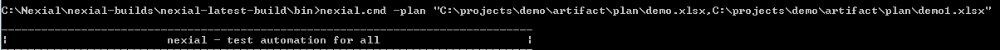

### Introduction
With the help of test plan, one can execute multiple scripts in one go. With this capability, one can also run multiple 
plan files containing multiple scripts. This will make life easier for a team to manage their work and execute all the test plans through one command.  

### Execute multiple plan files
To execute multiple plan files, run the same command which is used to run one plan that is **nexial.cmd -plan \<plan file1>,
\<plan file2>,\<plan file3>**. Make sure that plan file names must be **comma(,)** separated. 
 
Let's have a look at example.
If you want run two test plans demo and demo1 residing in same folder, run these two plan files like **nexial.cmd -plan 
C:\projects\demo\artifact\plan\demo.xlsx,C:\projects\demo\artifact\plan\demo1.xlsx**. See the image. 

### Insights of execution with multiple plans
One test plan will have multiple scripts. Nexial will consider all these scripts in all plan files as a list.
Using this list, nexial executes each script synchronously or asynchronously depending on **wait?** value in plan steps.
