### Introduction
Nexial generates logs -- essentially textual representation of the automation activities during execution -- so that 
one is informed of an execution progress. Some of these log information is displayed on the console during
execution, whilst some are stored to dedicated files for postmortem analysis. Understanding these log information is
important as they give a step-by-step account of the corresponding execution and provide pertinent (and sometimes 
detailed) data for root cause analysis.

-----

### Standard Log
When Nexial runs an execution, the execution activities are displayed on the console as well as written to a dedicated 
log file. Below is an snapshot of the execution logs on the console:<br/>
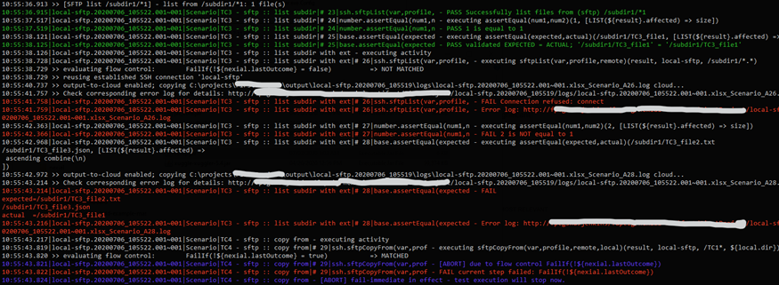

One will observe that:
1. Each log entry generally follow the following format:
   ```
   [log time]|[script file]|[scenario]|[activity]|[row number]|[command]|[log message]
   ```
2. Some log entry are displayed in different colors:
   <table cellspacing="0" cellpadding="5" style="margin-left: 20px">
   <tr>
   <td><b>PASS</b>ed steps</td>
   <td style="background-color: #000;"><span style="color:#0f0;padding:5px">GREEN</span></td>
   </tr>
   <tr>
   <td><b>FAIL</b>ed steps</td>
   <td style="background-color: #000;"><span style="color:#f00;padding:5px">RED</span></td>
   </tr>
   <tr>
   <td>Steps with <b>WARN</b>ing message</td>
   <td style="background-color: #000;"><span style="color:#ff0;padding:5px">YELLOW</span></td>
   </tr>
   <tr>
   <td>Steps that are <b>SKIP</b>ped (such as <a href="../flowcontrols/index.html#skipifcondition"><code>SkipIf</code></a>)</td>
   <td style="background-color: #000;"><span style="color:#d5d;padding:5px">MAGENTA</span></td>
   </tr>
   <tr>
   <td>Execution <b>ABORT</b>ed</td>
   <td style="background-color: #000;"><span style="color:#55f;padding:5px">BLUE</span></td>
   </tr>
   </table>
3. Some log entries are formatted slightly different in order to highlight their significance.
4. Some log entries span across multiple lines to improve readability. 

Each execution starts with high-level information about the runtime environment such as user, host, Java runtime and 
Nexial version number:<br/>
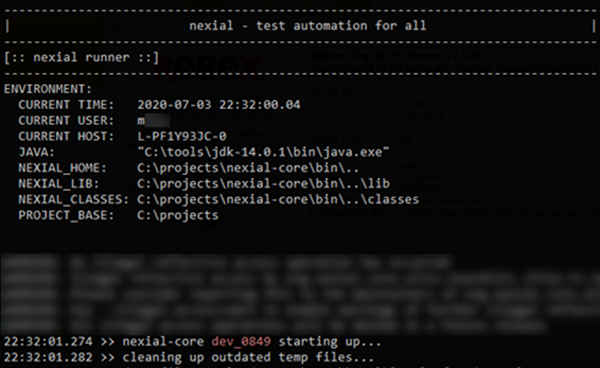

Each execution ends with a high-level execution summary information such as:
- location of the output
- total execution time
- total steps executed, passed, failed

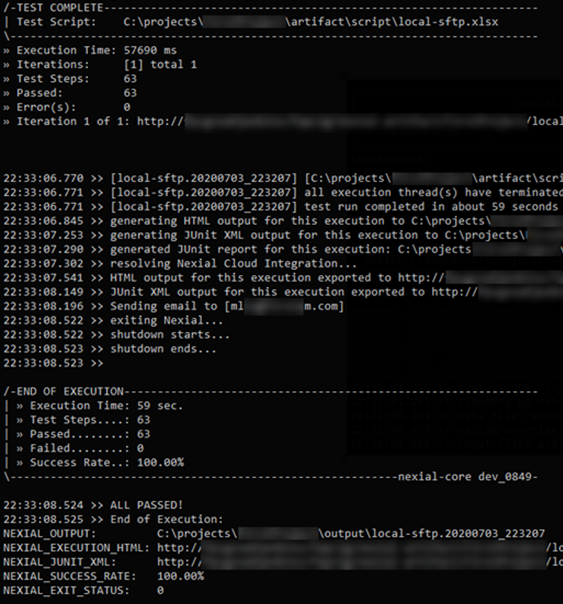

The same log information is also recorded to a designated log file, under 
`[output]/logs/nexial-[execution-timestamp].[log-start-date].log`, where:

- `[output]` is the output directory for a given execution
- `[execution-timestamp]` is the date/time of when an execution started. This is usually the same the output directory 
  name. The timestamp format is `yyyyMMdd_HHmmdd`.
- `[log-start-date]` is the date when this log file is generated. If an execution should continue to the next day, then
  a new log file would be generated with the `[log-start-date]` set to the next day. The date format is `yyyy-MM-dd`.
  
For example:<br/>
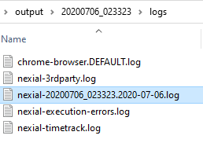

Since the log file is simply a text file, all the color information (as described above) would not be stored here. 
However it is useful to have the execution log available in a text file as this would facilitate root cause analysis
and postmortem discovery.

-----

### Failure Log File
At times, an execution failure would also result in an additional log file to be generated. This log file contains
details of the corresponding failure and can be helpful for reporting purpose.

From the standard log, the generation of such failure log is observed:<br/>
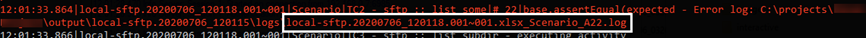

Below is a snapshot of such failure log:<br/>
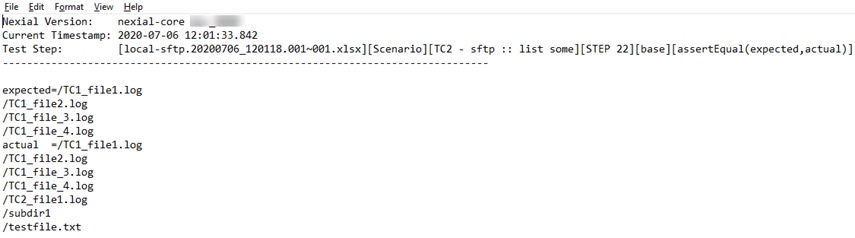

Note that each failure would result in a separate failure log to be generated.

-----

### ErrorTracker (error-only log file)
Having individual [failure logs](#failure-log-file) is useful since each failure can be analyzed separately. However for
a complex or long-running execution, it might be helpful to have another log file that "traps" all the failed steps
(either **FAIL**ed or resulted in failure). As such, one would only need to reference 1 file to find all the errors that
occurred during a particular execution.

This is the main motivation of the ErrorTracker. As of [Nexial 3.1](../release/nexial-core-v3.1.changelog), Nexial can
now optionally generate an error-only log file so that all the failed steps would be tracked in 1 place. This feature
is optional and can be activated by setting the System variable 
[`nexial.trackErrors`](../systemvars/index#nexial.trackErrors) as `true`. When enabled, Nexial generate all failed
steps information in a designated log fie - `[output]/logs/nexial-execution-errors.log`.

A snapshot of the ErrorTracker (`logs/nexial-execution-errors.log`) is as follows (broken into 3 images):<br/>
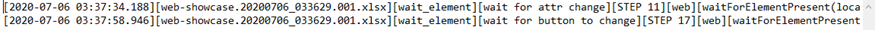...<br/>
...continued<br/>
...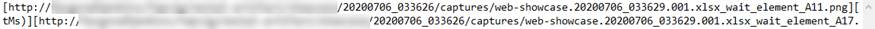...<br/>
...continued<br/>
...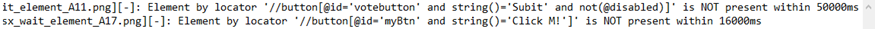<br/>

The log format is as follows:
```
[date/time][script][scenario][activity][step number][command type][command][error screenshot][failure log]: [error message]
```

- `[date/time]` is the date and time when the error occurred, in the format of `yyyy-MM-dd HH:mm:ss.SSSS`.
- `[script]` is the output file for the corresponding script.
- `[scenario]` is the scenario where the error occurred.
- `[activity]` is the activity where the error occurred.
- `[step number]` is the step number (row number) where the error occurred.
- `[command type][command]` is the command associated with the said error.
- `[error screenshot]` is the screenshot taken when the error occurred. This is only applicable to [web](../commands/web) 
  automation and [desktop](../commands/desktop) automation, and 
  [`nexial.screenshotOnError`](../systemvars/index.html#nexial.screenshotOnError) is turned on.
- `[failure log]` is the corresponding [failure log file](#failure-log-file), if available.

There might be situations where the ErrorTracker should be displayed as HTML - either as a HTML page or as a HTML table.
Displaying log information as HTML can improve readability. Converting the error logs into a HTML table means that these
logs can be embedded into a larger context (such as execution report).

Nexial supports such capability via the [`$(projectfile|ExecutionErrorsAsHTML)`](../functions/$(projectfile)#projectfileexecutionerrorsashtmltableonly)
built-in function. The idea with this function is to convert the existing error log information
(i.e. `logs/nexial-execution-errors.log`) into a HTML page or a HTML table. Here's a snapshot of the generated HTML:

```html
<html>
<header>
  <title>Execution Error for [project name]</title>
</head>
<body>
<table width="100%" class="execution-errors" cellspacing="0">
<thead>
    <tr>
        <th nowrap>date/time</th>
        <th nowrap>script</th>
        <th nowrap>scenario</th>
        <th nowrap>activity</th>
        <th nowrap>step</th>
        <th nowrap>command</th>
        <th>screenshot</th>
        <th>details</th>
        <th>message</th>
    </tr>
</thead>
<tbody>
    <tr>
        <td nowrap>...date/time...</td>
        <td nowrap>...script...</td>
        <td nowrap>...scenario...</td>
        <td nowrap>...activity...</td>
        <td nowrap>...step #...</td>
        <td nowrap>...command...</td>
        <td nowrap>...screenshot link, if any...</td>
        <td nowrap>...details link, if any...</td>
        <td nowrap>...error message...</td>
    </tr>
    <tr>
        ... ...
    </tr>
</tbody>
</body>
</header>
```

For HTML table, the portion before `<table>` and after `</table>` will be omitted.

We can add a bit of CSS in front of the generated HTML table to create a more appealing presentation, say, for [email
notification](../systemvars/index.html#nexial.enableEmail). Nexial's email notification allows one to include a custom
HTML-based ["mail header"](../systemvars/index.html#nexial.mailHeader) so that additional information can be included 
as part of the email notification. Suppose we have the following CSS:

```html
<style>
    table.execution-errors {
        background-color: #fff0f0;
        font-size:        9pt;
        padding:          5px;
    }

    table.execution-errors th, table.execution-errors td {
        text-align:     left;
        vertical-align: top;
        padding:        2px 5px;
    }

    table.execution-errors th {
        border-top:       1px solid black;
        border-bottom:    1px solid black;
        background-color: #ebb;
    }

    TABLE.execution-errors TD {
        color:         #600;
        border-bottom: 1px solid #777;
        border-right:  1px solid #999;
    }
</style>
```

We can combine this file with the generated HTML table of the error logs using the [`$(projectfile|ExecutionErrorsAsHTML)`](../functions/$(projectfile)#projectfileexecutionerrorsashtmltableonly)
built-in function, like this:

```
nexial.mailHeader |  $(projectfile|text|artifact/data/error-log-css.html)
                     $(projectfile|executionErrorsAsHtml|true)
```

When Nexial sends out email notification, it will evaluate `nexial.mailHeader` and render the appropriate HTML snippet 
(table) along with the CSS information. The end result looks something like this:<br/>
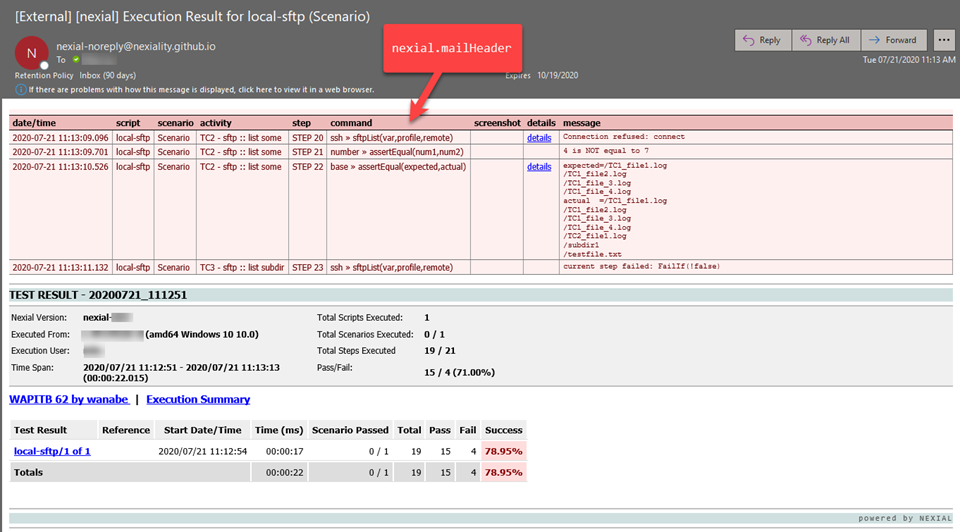

-----

### Time Tracking
Time tracking is an optional feature in Nexial to track elapsed time between two or more steps. These between-steps time
measurement are expressed as [flow controls](../flowcontrols/) and therefore can be placed in any arbitrary steps within
one of more scripts. For more information, visit the [Time Tracking](../flowcontrols/timeTracking) page.

-----

### Output-to-Cloud
Nexial's Output-To-Cloud feature enables the seamless transfer of log files (among other forms of output) to the 
designated cloud storage. When the necessary [setup](BatchFiles#nexial-setup) to configure cloud storage designation 
(S3) is complete, and [`nexial.outputToCloud`](../systemvars/index.html#nexial.outputToCloud) is set to `true`, Nexial
will automatically transfer any generated log files to the cloud. This can be observed in the standard log (console or 
file):

Without Output-to-Cloud enabled:<br/>
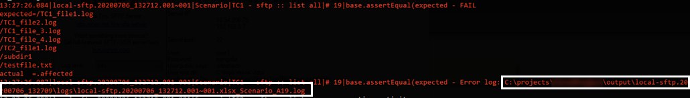

With Output-to-Cloud enabled:<br/>
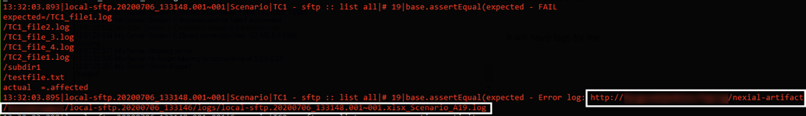

-----

