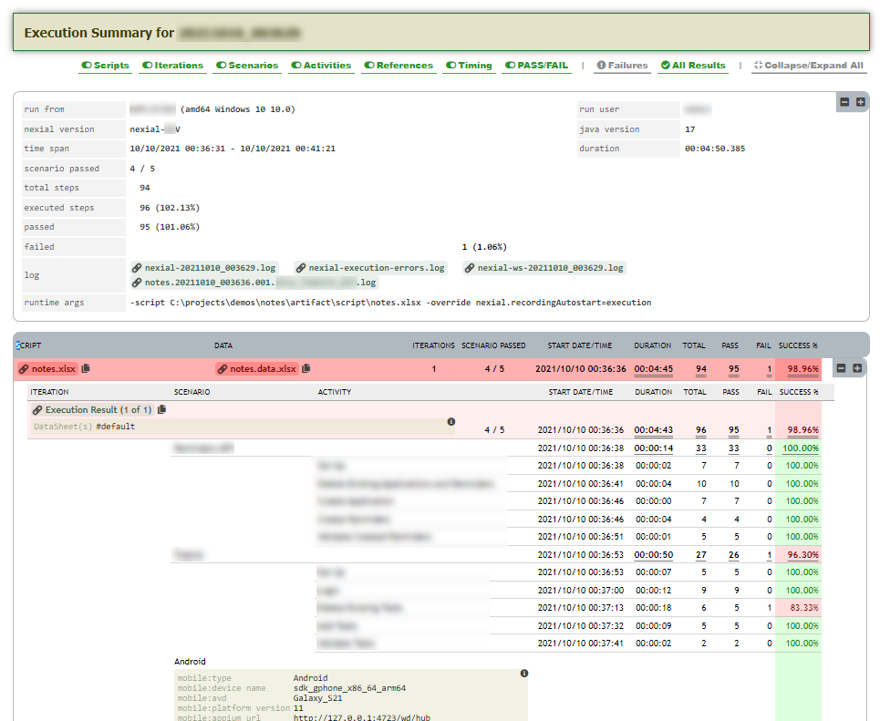
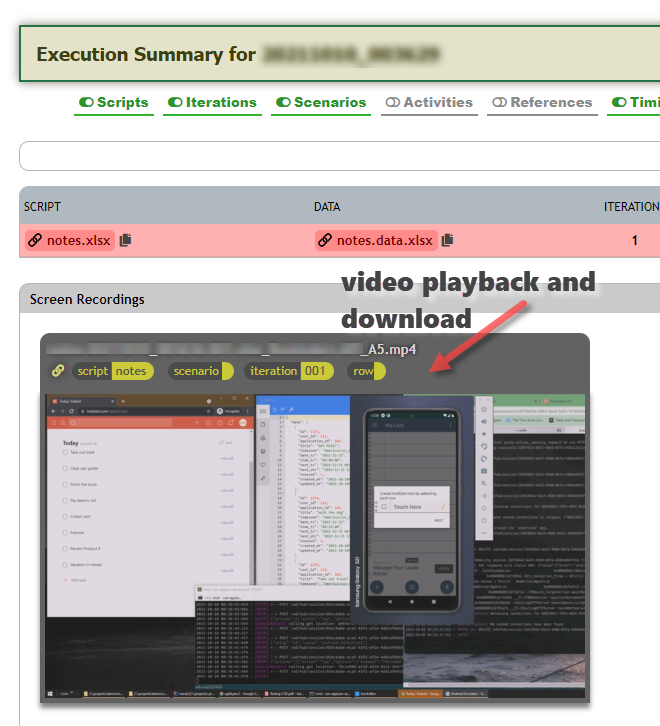
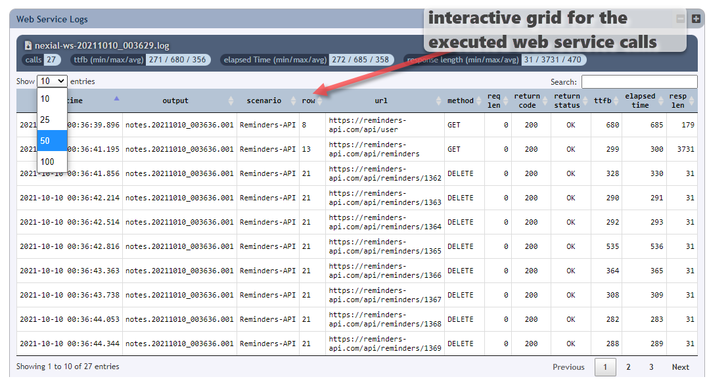
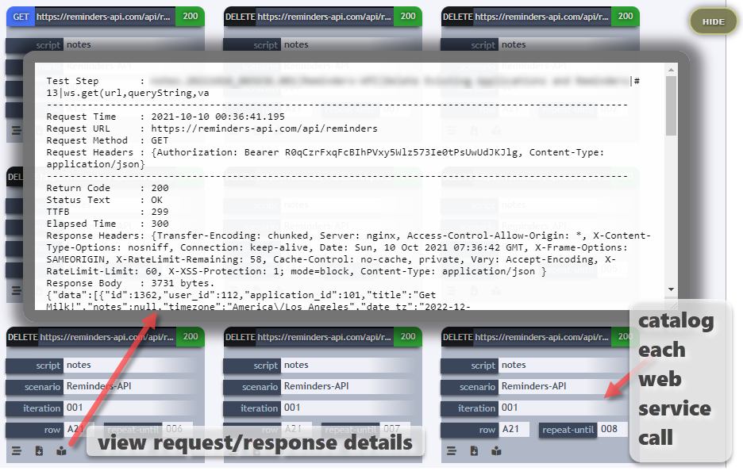

At the end of an execution, Nexial will generate a series of output. One of these output files is the Execution Summary,
which looks something like this:


One can find this HTML file in the designated output directory, named as `execution-output.html`.

While this file provides lots of meaningful and insightful information about an execution, there are a few things one
can do to further maximize its usability and usefulness.
1. Screen Capturing
   To enable screen capturing (only applicable for Web, Desktop, TN5250 and Mobile automation), one simply mark the
   appropriate "Screenshot" column with a `x`. By doing so, Nexial will perform a screen capturing when the corresponding
   step has completed its automation. Note that this screen capturing (a.k.a. screenshot) will differ, depending on the
   command in use. For web automation, the screen capturing will be performed on the currently-in-focus browser. For
   desktop automation, the screen capturing will be performed on the active application window. For mobile automation,
   the active emulator/simulator/device and for TN5250, the active TN5250 session. During the generation of the 
   Execution Summary (at the end of an execution), Nexial will then gather all the captured screenshots and list them 
   in the Execution Summary. This simplifies the review process and expedite any triage effort to following after 
   execution.  
2. Screen Recording
   Nexial provides desktop screen recording (as a video file) during automation, which can greatly improve the 
   post-execution review/triage process. To enable screen recording, simply apply the 
   [base &raquo; `startRecording`](../commands/base/startRecording()) command and the 
   [base &raquo; `stopRecording`](../commands/base/stopRecording()) command appropriately within your target script(s).
   Alternatively, one can utilize a specialized System variable 
   [`nexial.recordingAutostart`](../systemvars/index.html#nexial.recordingAutostart). By setting this System variable to
   `true`, Nexial will automatically start the screen recording when an execution starts. This is especially useful when
   used as a command line override. For example,
   ```
   nexial.sh -script ~/project/MyProject/artifact/script/MyScript.xlsx -override nexial.recordingAutostart=execution
   ```
   In this way, one can easily enable or disable screen recording at the time of execution.
   During the generation of the Execution Summary, Nexial will collect all the screen recordings and provide a video
   playback section in the summary file.
   
3. Web Service Analysis
   If one is performing any Web Service or API automation, it is recommended to enable the following 2 System variables:
   - [`nexial.ws.logSummary`](../systemvars/content.html#nexial.ws.logSummary) -- assign this System variable to `true
   - [`nexial.ws.logDetail`](../systemvars/content.html#nexial.ws.logDetail) -- assign this System variable to `true
   By doing so, Nexial will parse through all the generated Web Service log files (request, response, timing, etc.), and 
   generate an interactive analytic panel for the Web Service/API invocations performed during the execution.
   <br/>
   

