> Nexial requires Java 1.8.0_151 or above and Excel 2007/2010 or above. If you don't have Java installed on your system, 
> follow the next section to do so.

### Install Java

Check if Java is installed - **Java 1.8.0_151 or above required, and 64-bit Java is highly recommended**
   **If possible, consider installing the latest version of Java 1.8 or the latest release of Java.** 
   

    <ul class="tab-links tabs-collapsed">
        <li class="active"><a href="#tab3">Windows</a></li>
        <li><a href="#tab4">Mac OSX</a></li>
    </ul>
    

        

        <ol>
            <li>
			   Open the console by pressing Windows key and the letter R (<code>Win+R</code>) at the same time, 
			   type in <b>cmd</b> and press <b>&lt;ENTER&gt;</b> 
            </li>
			<li>
			    From the console, type <b>java -version</b> and press <b>&lt;ENTER&gt;</b> 
			    If you get something like the following, please follow the next step (Step 3) below to download and install 
			    Java: 
                 
                If you are not getting the above message, check that the version of Java installed is 1.8.0_151 or 
                above. For example, here's a snapshot of an outdated Java installation (1.6.0.45). 
                 
                While the snapshot below shows Java 1.8, this version of not supported. Please be sure that your Java 
                installation is <b><a href="https://www.oracle.com/technetwork/java/javase/downloads/jdk8-downloads-2133151.html" class="external-link" target="_nexial_link">Java 1.8.0_151 or above</a></b>: 
                 
                If your Java installation is outdated/unsupported, please follow the next step (Step 3) below to 
                download and install Java. 
			</li>
			<li>
			    To download Java, visit the following link:
			    <a href="http://www.oracle.com/technetwork/java/javase/downloads/index.html" class="external-link" target="_nexial_link">http://www.oracle.com/technetwork/java/javase/downloads/index.html</a> 
			    Click on the Download button: 
			    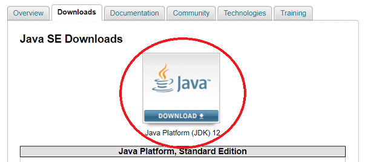 
			     
			    Scroll down to the bottom of the page and click <b>Accept License Agreement</b>. 
			    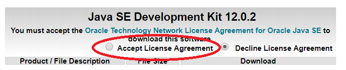 
			    Select the appropriate download file suitable for your operating system. It is recommended to select 
			    the <b>64bit version</b> for better performance and efficient memory management.
			</li>
        </ol>
        Please note that <a href="https://adoptopenjdk.net/upstream.html" class="external-link" target="_nexial_link">OpenJDK</a> 
        and <a href="https://docs.aws.amazon.com/corretto/latest/corretto-8-ug/downloads-list.html" class="external-link" target="_nexial_link">Amazon Corretto</a> 
        are also supported for Nexial. Both open-source JDKs are used by many Nexialists.  
        

        

        <ol>
            <li>
			   Open the Terminal app, or open Spotlight (CMD-Space) and then type, <b>terminal</b> and press 
			   <b>&lt;ENTER&gt;</b> 
            </li>
			<li>
			    From the console, type <b>java -version</b> and press <b>&lt;ENTER&gt;</b> 
			    If you get something like the following, please follow the next step (Step 3) below to download and install 
			    Java: 
                 
			    If you are not getting the above message, check that the version of Java installed is 1.8.0_151 or 
			    above. For example, here's a snapshot of an outdated Java installation (1.6.0.45). 
			     
                While the snapshot below shows Java 1.8, this version of not supported. Please be sure that your Java 
                installation is <b><a href="https://www.oracle.com/technetwork/java/javase/downloads/jdk8-downloads-2133151.html" class="external-link" target="_nexial_link">Java 1.8.0_151 or above</a></b>: 
			     
			    If your Java installation is outdated/unsupported, please follow the next step (Step 3) below to 
			    download and install Java. 
			</li>
			<li>
			    To download Java, visit the following link:
			    <a href="http://www.oracle.com/technetwork/java/javase/downloads/index.html" class="external-link" target="_nexial_link">http://www.oracle.com/technetwork/java/javase/downloads/index.html</a> 
			    Click on the Download button: 
			     
			     
			    Scroll down to the bottom of the page and click <b>Accept License Agreement</b>. 
			     
			    Select the appropriate download file suitable for your operating system. It is recommended to select 
			    the <b>64bit version</b> for better performance and efficient memory management.
			</li>
            Please note that <a href="https://adoptopenjdk.net/upstream.html" class="external-link" target="_nexial_link">OpenJDK</a> 
            and <a href="https://docs.aws.amazon.com/corretto/latest/corretto-8-ug/downloads-list.html" class="external-link" target="_nexial_link">Amazon Corretto</a> 
            are also supported for Nexial. Both open-source JDKs are used by many Nexialists.  
        </ol>
        

    

 

### Using Nexial Installer
**Note**: Nexial requires Java 1.8.0_151 or above and Excel 2007/2010 or above. If you don't have Java installed on 
your system, please follow the section above.

    <ul class="tab-links tabs-collapsed">
        <li class="active"><a href="#tab1">Windows</a></li>
        <li><a href="#tab2">Mac OSX</a></li>
    </ul>
    

        

            <ol>
                <li>
                    To keep things more structured, we will create a new directory for our installation process:   
                    Navigate to your local hard drive and create a new folder called **projects** (i.e. 
                    <code>C:\projects</code>). 
                    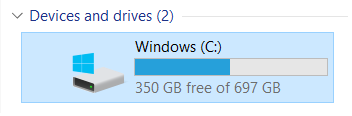
                </li>
                <li>
                    Click the following link to begin downloading the Nexial installer:
                    <a href="https://github.com/nexiality/nexial-installer/releases/download/nexial-installer-v1.4.3/nexial-installer-1.4.3.zip" 
                    class="external-link" target="_nexial_link">Nexial Installer</a>.
                </li>            
                <li>
                    Next, locate the downloaded zip file in your Downloads folder.
                     
                    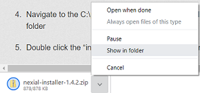
                </li>            
                <li>
                    Unzip the <code>nexial-installer.zip</code> file into the <code>C:\projects\</code> directory that 
                    you just created.  
                    To do this, right-click on <code>nexial-installer.zip</code>, select 
                    <code>Extract All</code> and then type in <code>C:\projects</code>: 
                    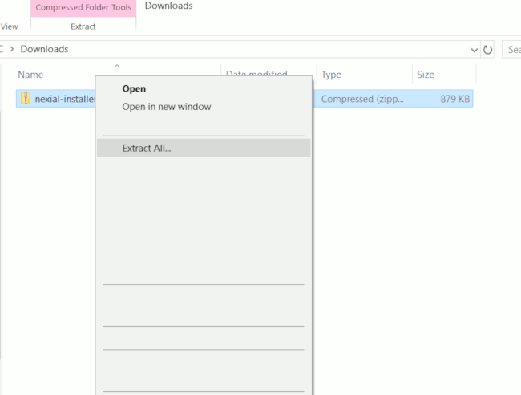
                </li>            
                <li>
                    Navigate to <code>C:\projects\</code> directory and double click on the newly created 
                    <code>nexial-installer</code> folder, then double click the <code>bin</code> folder: 
                    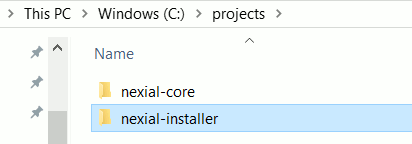
                </li>            
                <li>
                    Double click <code>install-latest.cmd</code> file (<b>NOT</b> the <code>install-latest.sh</code> 
                    file). 
                    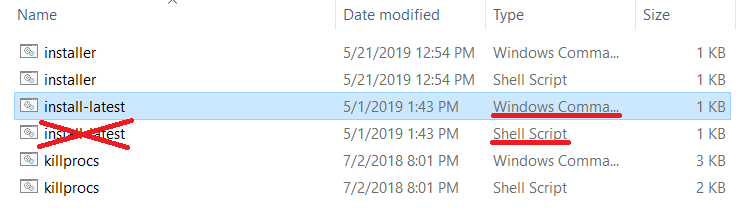
                </li>            
                <li>
                    Let the command prompt run; this may take a while. When it finishes, it should close itself and you 
                    now have the latest Nexial installed onto your computer!
                </li>
            </ol>
        

        

            Create a new directory under your HOME directory named <code>projects</code>. Both Nexial (the 
            automation platform) and Nexial Installer will be installed individually under this directory. 
            <ol>
                <li>
                    Open Finder: 
                    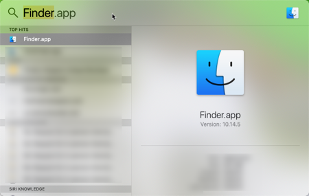
                </li>
                <li>
                    Navigate to your HOME directory via shortcut <code>COMMAND-SHIFT-G</code>, then type in <code>~/</code>: 
                    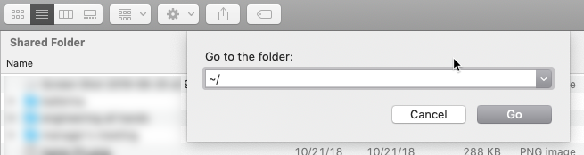
                </li>
                <li>
                    Create a new directory via shortcut <code>CONTROL-SHIFT-n</code>, then type in <code>projects</code>: 
                    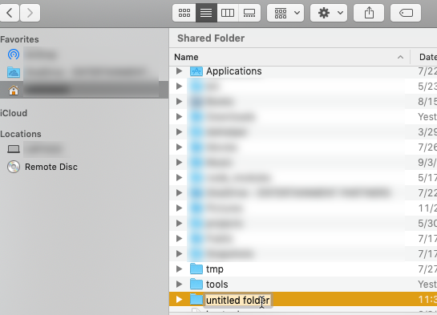
                </li>
                <li>
                    Click the following link to begin downloading the Nexial installer:
                    <a href="https://github.com/nexiality/nexial-installer/releases/download/nexial-installer-v1.4.3/nexial-installer-1.4.3.zip" 
                    class="external-link" target="_nexial_link">Nexial Installer</a> 
                     
                    By default, it will be downloaded to the <code>Downloads</code> directory. Move this file to the 
                    newly created <code>projects</code> directory (`~/projects`): 
                    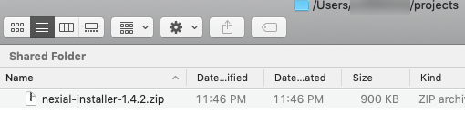
                </li>            
                <li>
                    Rename the Nexial Installer zip by removing its version number from the zip file. That way, it will
                    unzip to a directory named as <code>nexial-installer</code> (instead of <code>nexial-installer-1.4.3</code>): 
                    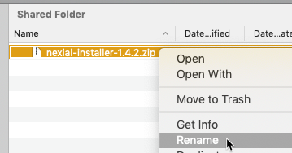 
                    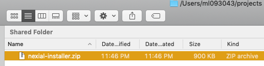 
                </li>
                <li>
                    Double-click on <code>nexial-installer.zip</code> to start unzipping this file. This will unzip 
                    <code>nexial-installer.zip</code> to a directory named as <code>nexial-installer</code>: 
                    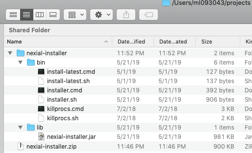 
                    Note that the unzip directory contains a <code>bin</code> and a <code>lib</code> directory.
                </li>
                <li>
                    Expand `nexial-installer` and then expand `bin` directory. Right-click on 
                    <b><code>installer-latest.sh</code></b> (NOT <code>installer-latest.cmd</code>). Choose either 
                    <code>Terminal.app</code> or <code>iTerm.app</code>: 
                    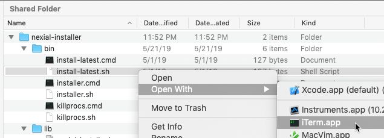 
                    <ol style="list-style: lower-roman">
                    <li><b>If none of the terminal app shows up on the list:</b> click "other" then in the drop down 
                    menu labeled "Enable:" select "All Applications". From here, navigate through the Applications 
                    folder then enter the Utilities folder and select the Terminal application.
                    </li>
                    <li><b>iTerm.app</b>: iTerm is an excellent terminal replacement for MacOSX's default Terminal.app. 
                    This is optional to install or run Nexial. To install iTerm, please download it from
                    <a href="https://www.iterm2.com/downloads.html" class="external-link" target="_nexial_external">
                    iTerm2 download page</a>.
                    </li>
                    </ol>
                </li>
                <li>
                    Nexial installation will commence: 
                    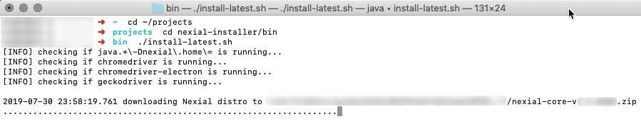 
                     
                    Give it a few minutes or so, Nexial installation will complete and you will have yourself the 
                    latest Nexial installed on your computer! 
                    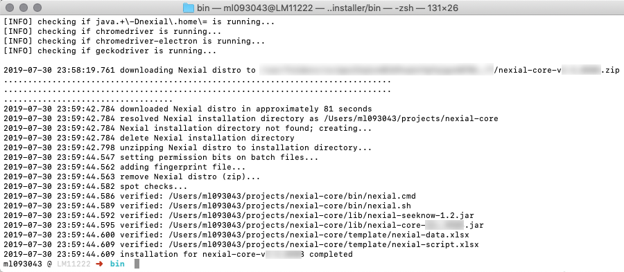
                </li>
            </ol>
        

    

 

### Check Excel Version
Nexial requires Excel 2007/2010 or above. It requires the use of XLSX format (old XLS format not supported).

### Checking Browser Availability and Version
1. **Internet Explorer** - Nexial at this time only supports Internet Explorer 9 or above. In the future we might 
   consider older versions of Internet Explorer. Nexial however will support either 32 or 64 bit.

2. **Firefox** - as stated on Selenium's website: "..._Support for Firefox is the latest release, the previous 
   release, the latest ESR release and the previous ESR release..._" However there is a high likelihood that older 
   versions of Firefox will work as well. Support from Nexial team is provided on a case-by-case basis.

3. **Chrome** - latest and almost all recent versions are supported. Older version can be supported via using the 
   corresponding 
   <a href="https://sites.google.com/a/chromium.org/chromedriver/downloads" class="external-link" target="_nexial_link">older versions of chrome driver</a>.

4. **Safari** - version 9 or above is supported, with the latest most likely to be most stable in terms of support.

### Starting Your First Project
Now that you have Nexial installed, we can create our first Nexial Project! 
Click [here](SettingUpYourFirstProject) for a guide on starting your first Nexial Test Automation.