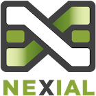

### What is Nexial?
Nexial is a test automation platform based on a hybrid test design approach.  At its core, its 
design centers around the following goals:

1.  **Lightweight Application Architecture**  
    Nexial requires very simple installation (_just unzip_) and low computing requirement to get 
    started.  It is designed to run standalone, within a CI/CD pipeline, and within a cloud 
    environment.  

2.  **No Coding Required**  
    Programming/Coding should not be an entrance requirement (_hindrance?_) to Test Automation.  
    Instead, automation engineers can focus on system-user interaction, acceptance criteria and 
    domain knowledge to shorten the quality feedback loop and raising quality consciousness across 
    the team.  Since no coding is required, it is faster and less costly to develop automation 
    scripts with Nexial.  With Nexial, automation engineers can elaborate the test steps, scenarios 
    and data using spreadsheets.  Nexial also supports the execution of external programs so any 
    pre-existing scripts can be launched as part of a test execution.  

3.  **Hybrid Test Design Approach**  
    For the most part, test automation is the combination of ‘Action’ and ‘Validation’:  action to 
    simulate interaction and workflow, and validation to assert an expectation.  Using a hybrid 
    approach, Nexial combines the complimentary techniques of keyword-driven automation and 
    data-driven automation, plus a few of Nexial’s own, to create a test automation platform that 
    yields a high level of readability, flexibility and reusability. Some would regard Nexial as an 
    archetype of the _Codeless Automation_ framework.  
      
4.  **Open and Practical Test Artifact**  
    Using a structured format such as a spreadsheet as the basis of all test artifacts might seem 
    restrictive to some.  On the flip side, it provides the consistency and predictability to keep 
    the entire project team equitably informed.  Quality aware is elevated across the board because 
    Nexial generates a consistent, open and easily consumable test report.  
      
5.  **Promote Cohesion and Transparency**  
    By providing consistent format and convention across the test script, data and suite, Nexial 
    provides a uniformity across the design and execution aspects of software testing.  The test 
    steps, the associated test data and the execution result are immediately visible to all.  Such 
    test output provides a clear indication of the quality objectives that is consumable to both 
    technical and non-technical audience.  
      
6.  **Application platform agnostic**  
    Nexial is designed to automate desktop applications (Windows only for now), Web application 
    via any of the major web browsers, service application (HTTP, REST, SOAP) and database 
    application (all major databases).  In addition, it comes with a growing set of features to 
    manipulate format-specific file content (PDF, Excel, CSV, XML, JSON, etc.) and common data 
    manipulation capabilities.  All these capabilities are accessible via the same spreadsheet.

### What can I do with it?
One can use Nexial to create test automation across a myriad of applications such as desktop 
applications, web applications, service applications, etc.  Coding is not required. Via 
[simple conventions](UnderstandingProjectStructure) and [test design guidelines](UnderstandingExcelTemplates), 
one can create test automation that maintains independence between the test (test steps) and data, 
and flexibility to mix-and-match test scripts and test data at execution time.

### How does it work?
Here is the basic workflow:
1.  Automation engineer captures test steps and validation using spreadsheet (test script).
2.  Automation engineer enters test data into a separate spreadsheet (test data).
3.  Automation engineer executes Nexial by specifying the spreadsheet to run.
4.  Nexial reads the test script spreadsheet and test data spreadsheet.
5.  Nexial interprets each test step and the associated test data, and executes the appropriate 
			 automation command against the specified AUT.
6.  Nexial records the outcome of each test step to the output file.
7.  When all the steps in the spreadsheet have been executed, the output file is available for 
				review and distribution.

Using Nexial-designed spreadsheet with a dropdown (or pull-down) of commands (keywords), Step 1 can be greatly 
simplified.

Step 3 through 7 can be a part of a larger CI/CD orchestration.

### What do I need to get started?
In a nutshell, one would need:
1.  A computer (PC, Mac, and *NIX most of the time).
2.  JDK 1.8+
3.  Nexial distribution

For more details and step-by-step instruction, check out the [Install Nexial](InstallingNexial) page.

### Where can I go for more help/support?
For online documentation, start [here](../commands/).  For additional questions, inquiries or help, 
submit your request to our 
<a href="https://github.com/nexiality/nexial-core/issues" class="external-link" target="_nexial_link">GitHub issue</a>.  Likewise, for any 
suggestion on new features for Nexial, submit an 
<a href="https://github.com/nexiality/nexial-core/issues" class="external-link" target="_nexial_link">issue</a> as well. 

### What can I expect from future release?
Even before it’s 1.0 debut, Nexial has been in use by multiple projects.  But in a way, this isn’t 
a ‘1.0’ release – at least not in the typical sense.  Calling it ‘1.0’ is just a way to officially mark 
its progress, and to give us a way of comparing against future releases.  The cadence we would like 
to keep would be two-fold:

1.  Daily DEV builds, as we do today.  For newer features and early access patches, this would be 
			 the method of distributing.
2.  Monthly `MAJOR.MINOR` release.  Mostly likely we would keep to the `x.y` release schema where 
				`x` starts from `1` and `y` is a number between 0 to 9.

Ready to get started? Click [here](index.html).
