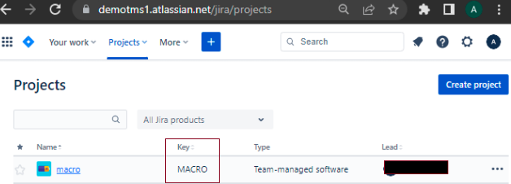
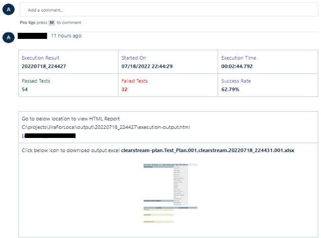

### Overview
Jira is a test management and development software tool that helps teams to manage and track their software testing
efforts. Jira enables you to create, manage, and organize test cases and suites within an optimized user interface
and application structure.

Test suite and test cases will be added as a jira issue. For jira, test suite and test cases are following hierarchy 
same as Jira issue types. By default, jira issue type for Test Suite is `Story` and for Test Case is `subtask`. 
Explicitly, user can specify test suite issue type and test case with variable [`nexial.tms.suiteIssueType`](../systemvars/index#nexial.tms.suiteIssueType)
and [`nexial.tms.caseIssueType`](../systemvars/index#nexial.tms.caseIssueType) respectively.

### HOW to import Testcases in Jira
Importing testcases to Jira includes following steps:-
1. Prerequisite configuration to access Jira.
2. Configure Nexial Data Variables to access Jira through apis.
3. Configure project meta file to access required Jira project.
4. Import testcases using Nexial batch file [nexial-tms-importer](./BatchFiles#nexial-tms-importer)

**Prerequisite Configuration on Azure DevOps**:- 
- Generate API token to access Jira APIs. Please go through docs to see
  [How to Generate Token](https://support.atlassian.com/atlassian-account/docs/manage-api-tokens-for-your-atlassian-account/) in detail. 
   

**Configure Using Data Variables**:- 
- [`nexial.tms.source`](../systemvars/index#nexial.tms.source): User should specify tms source tool to import testcases. In this case, it must be **jira**.
- [`nexial.tms.url`](../systemvars/index#nexial.tms.url): URL which consists of organization name in it. e.g. `https://<organization>.atlassian.net/`.
- [`nexial.tms.username`](../systemvars/index#nexial.tms.username): Email id used to log in to jira account.
- [`nexial.tms.accessToken`](../systemvars/index#nexial.tms.accessToken): Api token to access Jira. Click here to [Generate Jira API token.](https://id.atlassian.com/login?application=manage-profile)
- [`nexial.tms.suiteIssueType`](../systemvars/index#nexial.tms.suiteIssueType): Suite type depending on hierarchy supported. You can have any issue type of higher hierarchy. By default, it's `Story`.
- [`nexial.tms.caseIssueType`](../systemvars/index#nexial.tms.caseIssueType): Testcase type depending on hierarchy supported. It must be lower in hierarchy than suite type. By default, it's `subtask`.

~~~
# values are for jira devops for reference except source name
nexial.tms.source=jira
nexial.tms.url=https://demotms1.atlassian.net/
nexial.tms.username=xyz@gmail.com
nexial.tms.accessToken=uhKFR9OaK5cZpvXPrRlF9AD612
nexial.tms.suiteIssueType=Epic
nexial.tms.caseIssueType=Story
~~~

User needs to provide above configuration to access jira through Nexial variables using one-time setup, you can provide 
Jira integration configuration details once and build `setup.jar` using [`nexial-setup.cmd|.sh`](BatchFiles#nexial-setup) 


**Note : `projectId` must be project key in the Jira which can be seen in respective project settings.**

**Import Test cases**:-
- User can import testcase using Nexial batch file [nexial-tms-importer.](BatchFiles#nexial-tms-importer)
- If there are any changes made to testcases for example adding new test case, deleted or updated,
  user need to update testcases using the same batch file command [nexial-tms-importer.](BatchFiles#nexial-tms-importer)

Sample screenshots after importing test result: 
- Test Suite screenshot
  
- Individual Test Case screenshot
  

### HOW to upload Testcase Execution Results in Jira
1. **(Mandatory)** Make sure testcases are already imported to Jira before uploading result as explained above.
2. Make sure during script execution in Nexial, [`nexial.generateReport`](../systemvars/index#nexial.generateReport) must be set to `true`.
3. Upload results for imported script or plan Test suite using batch file [`nexial-tms-result-uploader.cmd|.sh`](BatchFiles#nexial-tms-result-uploader)
4. For Jira, results will be added as a comment for imported testcases as issue. For suite, sample test result will be 
like below, 
   
For Test case, sample test result is like below, 
 

### See Also
- [Azure DevOps](AzureDevOpsSetup)
- [TestRail](TestRailSetup)
- [Tms Management](TmsManagement)
