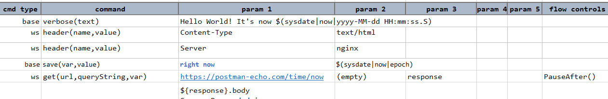
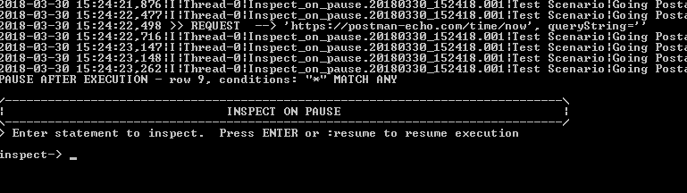
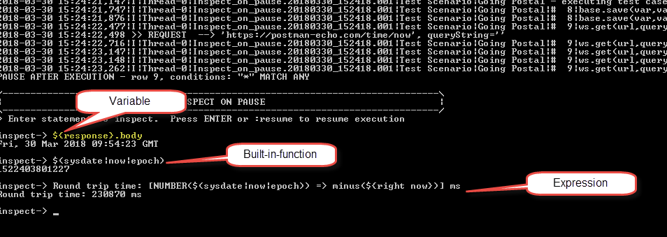
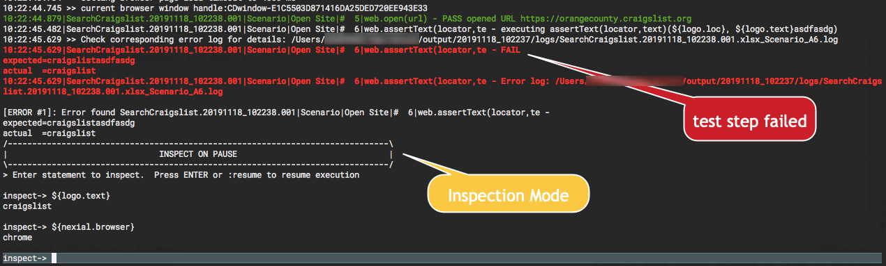
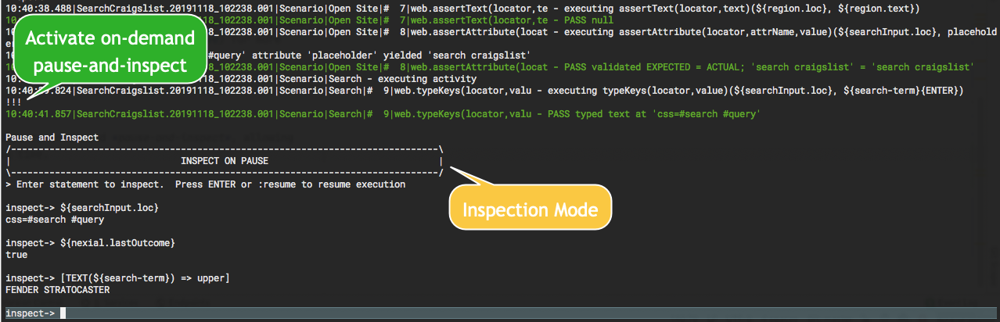

> **NOTE**: **[Nexial Interactive](../interactive)** now includes Inspection, and is generally considered a better 
> feature for exploring data variables and expression during execution. After reading about Inspection, you may want
> to also learn more about **[Nexial Interactive](../interactive)**.

As one's automation becomes more involving and complex, execution-time inspection may be of greater importance. The idea 
of allowing one to temporarily interrupt the execution in progress to examine the application under test, the execution 
log or execution states (i.e. data variables). 

### About Inspection
In Inspection mode, one can interaction with Nexial via its execution console. Use the `${...}` syntax to inspect data
variables:
<pre style="color:#aaa">
inpect-> ${nexial.textDelim}
,

inpect-> ${nexial.browser}
chrome

inpect-> ${username.locator}
//input[@name="username"]
</pre>

Likewise, one can invoke [built-in functions](../functions) via its `$(...)` syntax or 
[Nexial Expression](../expressions) via its `[... => ...]` syntax:
<pre style="color:#aaa">
inspect-> $(random|integer|5)
41465

inspect-> $(count|upper|This Is A Test)
4

inspect-> $(count|size|This Is A Test)
14

inspect-> [TEXT(This Is A Test) => after(Is )]
A Test

inspect-> [TEXT(This Is A Test) => base64encode ]
VGhpcyBJcyBBIFRlc3Q=

inspect->
</pre>

To resume, simple press `ENTER` key or type in `:resume` to continue execution.

#### Benefits of Inspection
- Observe the value of a data variable at a particular point in the execution.
- Observe the outcome of a [`Nexial Expressions`](../expressions/index) in the script at a particular point in the 
  execution.
- Observe the outcome of a [`Nexial Built-in-Functions`](../functions/index.html) in the script at a particular 
  point in the execution.

Nexial provides a few different forms of execution-time inspection:
1. [Control Flow Directives](#control-flow-directives)
2. [On Error](#on-error)
3. [Nexial Interactive](../interactive/)
4. [On-Demand Inspection ](#on-demand-inspection)

#### Disabled during Continuous Testing
> **Note**: Nexial is designed to disable "pauses" in CI/CD environment, which it determines dynamically at runtime. 
> One can also force [Nexial to consider current environment as CI/CD](../userguide/ExecutingNexialInCICD). 

-----

### Control Flow Directives
With [`PauseBefore()`](../flowcontrols/index#pausebefore()--pauseafter()) and 
[`PauseAfter()`](../flowcontrols/index#pausebefore()--pauseafter()), one can pause an execution to review 
execution logs and state. Also, "inspect-on-pause" provides the capability to inquire in real time the state of 
data variables, or the use of [built-in functions](../functions) and [Nexial expressions](../expressions). Since this 
can be enabled from any test step, this is particularly useful for troubleshooting and debugging running scripts.

#### How does it work?
- Find the test step(s) where the execution should be paused.
- Add [`PauseBefore()`](../flowcontrols/index#pausebefore()--pauseafter()) or 
  [`PauseAfter()`](../flowcontrols/index#pausebefore()--pauseafter()) to the flow control column of such step(s).
- Optionally, set the system variable [`nexial.inspectOnPause`](../systemvars/index#nexial.inspectOnPause) as `true`. 
  This can be done in [various places](../userguide/DataManagement).
- [Execute your script](../userguide/BatchFiles#nexial) as one normally would. Nexial would pause the
  execution just before (`PauseBefore()`) or just after (`PauseAfter()`) the test steps where the "pause" control 
  flow directive was placed. Now we can interact with Nexial to inspect data variables, etc.
- When inspection is complete, one can press `ENTER` key or type in `:resume` to continue execution.

#### Example
In the screenshot below, notice that a `PauseAfter()` directive is added in the flow control of the last step. Also, the 
System variable [`nexial.inspectOnPause`](../systemvars/index#nexial.inspectOnPause) is set to `true` in the 
corresponding data file (not shown). Let's see how we can, during execution, obtain the current timestamp from a API, 
check the response received and process it to get the elapsed time and round-trip time: 

When the inspect-on-pause is in effect, you should see a prompt on the console as shown below: 

Now we can (example):
- Inspect the payload of the API response via `${response}.body}`
- Run a built-in function to find the current date/time in _epoch_ via `$(sysdate|now|epoch)`
- Run a Nexial expression to find the elapsed time:  
  `Round trip time: [NUMBER($(sysdate|now|epoch)) => minus(${right now})] ms` 
  
To resume execution, simply press `Enter` key on the console.

-----

### On Error
Nexial allows execution to pause when an error occurred or when a test step has failed. To enable this feature, set
the System variable [`nexial.pauseOnError`](../systemvars/index#nexial.pauseOnError) to `true`. Also, one can set 
another System variable [`nexial.inspectOnPause`](../systemvars/index#nexial.inspectOnPause) to `true` to enable 
Inspection mode when the execution is paused (in this case, due to the failure of a test step).

-----

### Nexial Interactive
Nexial Interactive provides much more capability and features than just pausing execution and inspection. This is the 
recommended strategy to author your automation script. Please visit [Nexial Interactive](../interactive) for more 
details.

-----

### On-Demand Inspection
As of [version 2.9](../release/nexial-core-v2.9.changelog) Nexial now supports On-Demand Inspection (a.k.a. "odi"), 
which allows one to pause an execution in progress at or near the desired moment in time. To activate this feature, 
simply put the execution console in focus and type in `!!!` and then press the `ENTER` key. For example, 

This On-Demand Inspection is enabled by default and incur a slight penalty in terms of performance. For it to work, 
Nexial has to spawn a separate "listener" for any incoming input to the console during execution. Consider the benefits, 
this is a relatively small *price* to pay. However one can turn off On-Demand Inspection feature by setting the System 
variable [`nexial.odiEnabled`](../systemvars/index#nexial.odiEnabled) to `false` (default is `true`). One 
can also reconfigure the behavior of On-Demand Inspection with the following System variables:

- [`nexial.odiTimer`](../systemvars/index#nexial.odiTimer): determine the frequency, in milliseconds, of input 
  detection by the On-Demand Inspection "listener". Note that setting this value too low could cause an execution to 
  hang or become unresponsive since there could be too much resource contention between the main execution thread and 
  the "listener" thread. The minimum allowed value is `300` (ms); the default is `500` (ms).
- [`nexial.odiKeys`](../systemvars/index#nexial.odiKeys): determine the key sequence to activate On-Demand Inspection.
  The default value is `!!!` but one can change it to other ASCII character sequence. Note that compound key sequences 
  that contains `[CONTROL]`, `[ALT]`, `[WIN]`, `[OPTION]`, `[COMMAND]` are **not supported**, as such are usually 
  trapped by the underlying console application.

-----

