### Creating Your First Project
Creating Project Structure

    <ul class="tab-links tabs-collapsed">
        <li class="active"><a href="#tab1">Windows</a></li>
        <li><a href="#tab2">Mac OSX</a></li>
    </ul>
    

        

        <ol>
            <li>
				Open the command prompt and change the current directory to the "bin" directory under the Nexial 
				installation directory. To do this, <ol>
				<li>type <code>c:</code> and ENTER</li>
				<li>type <code>cd C:\projects\nexial-core\bin</code> and then ENTER</li>
				</ol>
				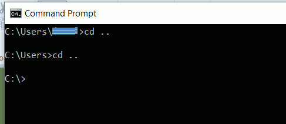
            </li>
			<li>
			    From here, let's create a new Nexial project via the <a href="BatchFiles#nexial-project">
			    <code>nexial-project</code></a> utility. 
			    At the command prompt, enter <code>nexial-project.cmd MyFirstProject</code>
			</li>
			<li>
			    If everything works, then you should see the message <code>creating project home at ...</code> and 
			    <code>DONE</code> 
			    
			</li>
			<li>
			    You should see the following directory created, along with various files in it: 
				 
			</li>
        </ol>
		Do not close the command prompt as you will need this later.
        

        

        <ol>
            <li>
              Open Terminal.app or iTerm.app (separate installation required) via Spotlight: 
              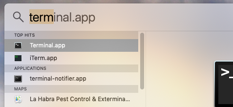
            </li>
			<li>
			  Once the terminal is opened, navigate to the "bin" directory under the Nexial installation directory 
			  (<code>NEXIAL_HOME</code>). To do this, type <code>cd ~/projects/nexial-core/bin</code> and ENTER.
			</li>
			<li>
			    From here, let's create a new Nexial project via the <a href="BatchFiles#nexial-project">
			    <code>nexial-project</code></a> utility. 
			    At the command prompt, <ol>
			    <li>create a new directory: <code>mkdir ~/projects/MyFirstProject</code> and ENTER</li>
			    <li>
			      create a new Nexial project: <code>./nexial-project.sh MyFirstProject</code> 
			      <b>Be sure to include the dot-slash (<code>./</code>) in front of <code>nexial-project.sh</code></b>
			    </li>
			    </ol>
			    Note: feel free to substitute <code>MyFirstProject</code> with another name of your choice.
			    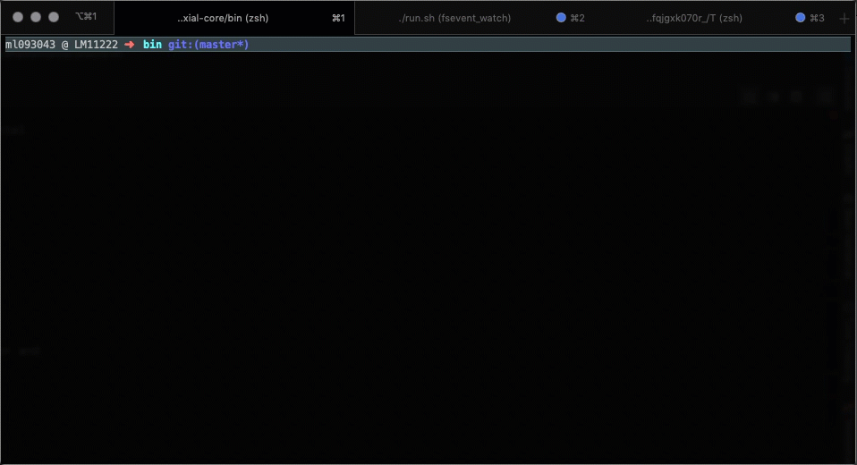
			</li>
			<li>
			  You should see a bunch of files created in the <code>projects/MyFirstProject</code> directory: 
			  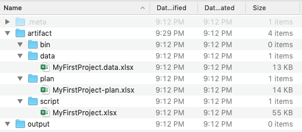
			</li>
        </ol>
		Do not close the command prompt as you will need this later.
        

    

 

#### Additional References
1. To gain better understanding of the project structure, check out 
  [Understanding Nexial project structure](UnderstandingProjectStructure)
2. To gain better understanding of the Nexial automation script format and usage, check out 
  [Understanding Nexial Test Artifact](UnderstandingExcelTemplates)

_Now it's time to run some automation_!

### Running your first test automation
The "Hello World" of Nexial automation

1. Open `C:\projects\MyFirstProject\artifact\script\MyFirstProject.xlsx` (Windows) or 
   `$HOME/MyFirstProject/artifact/script/MyFirstProject.xlsx` (Mac) created in the previous process - we refer to this 
   Excel file as the _test script_ or the _automation script_. By [convention](UnderstandingProjectStructure) all Excel 
   files under the `artifact/script` directory are considered as automation scripts.

2. Start the first test case by doing the following: 
	1. Enter "Greetings" under the <b>activity</b> column. This column's purpose is to group a series of actions 
	   with a meaningful name. 
	   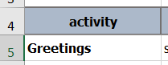 
	2. Under the **description** column, enter "say hello". This column is used to contain the description of what the 
	   corresponding action should do.   
	    
	3. In the <b>cmd type</b> column, there should be a drop down menu. From this menu, select "base". This column 
	   organizes and specifies various types of Nexial commands.   
	   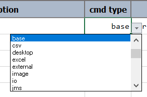 
	4. In the <b>command</b> column, you can now select a new command from the drop down menu. The commands you can 
	   select from in this column come from a Nexial list of commands labeled as "base" commands due to the type of 
	   command we selected in the <b>cmd type</b> column from the previous step. 
	   For our first script, we will select, `verbose(text)`.   
	   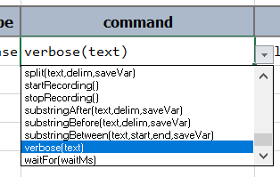 
	5. In the <b>param 1</b> column, type in `Hello World`. This column as well as the other <b>param #</b> columns are 
	   parameters that you fill in based on the <b>command</b> column's required parameter. In our example, the 
	   "verbose(<b>text</b>)" command requires <b>text</b> as a parameter.   
	   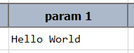 
	
	Your project should now look something like this: 
	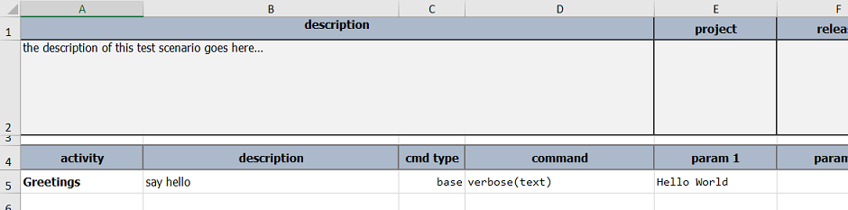

3. Save/close this automation script.

4. Return back to the command prompt and type: `nexial.cmd -script ` (leaving a space before and after `-script`). 
   Either,
   1. Manually type the location of `MyFirstProject.xlsx` file that we were working on -  
      (Windows) `C:\projects\MyFirstProject\artifact\script\MyFirstProject.xlsx` or   
      (MacOS) `~/MyFirstProject/artifact/script/MyFirstProject.xlsx`
   2. Drag and drop the xlsx file into the command prompt.
   After doing either step 1 or 2, press <b>Enter</b> and wait a little bit.

5. If all's well, you should see something like the following on your console: 
   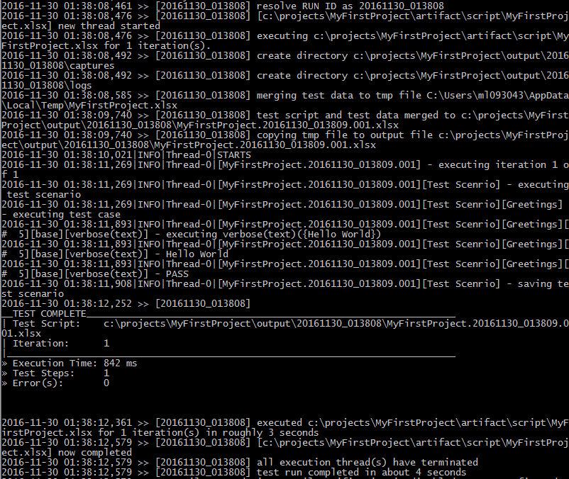 

   For now, don't worry too much about these logs. The most critical portion is near the end where Nexial reports a 
   summary of the test. The above screenshot showed that 1 iteration ran, with 1 step completed within 842ms.

6. After the above finishes processing and if your "<b>artifact/data/MyFirstProject.data.xlsx</b>" file (Excel file 
   located in the "artifact/data" folder) has `nexial.openResult` set as `true`, two things should open up:
   1. An Excel should open a new spreadsheet displaying the output of the test you just ran.
   2. Your main browser should open up a web page with the execution summary of the test we just ran.
	
   The new Excel file should look something like this:  
     
   Meanwhile, your browser should display something like this: 
   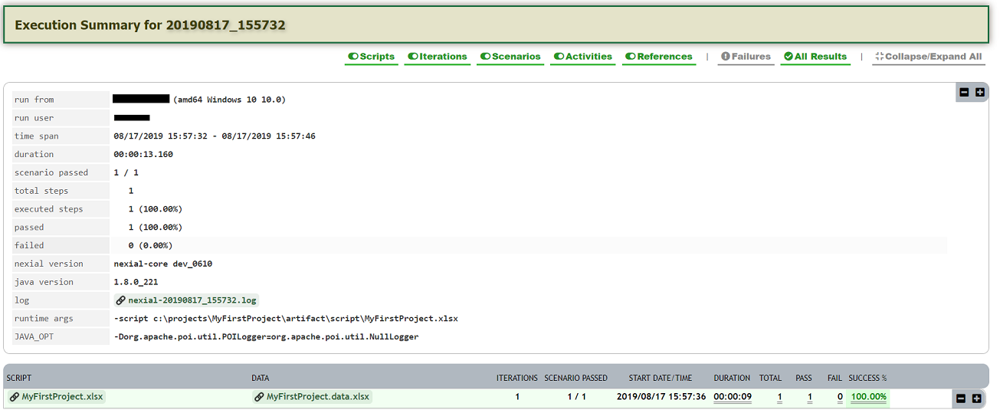  

**Congratulations**! You have just successfully run your first automation script via Nexial. Let's 
dig deeper...

### a little bit more...
1. let's create a few more lines for this test case:
   _MORE TO COME..._

### Diving Deeper
1. install .NET Framework 4.6.2 for desktop automation

