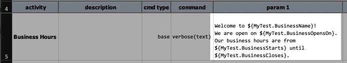
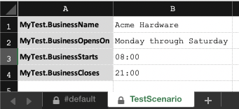
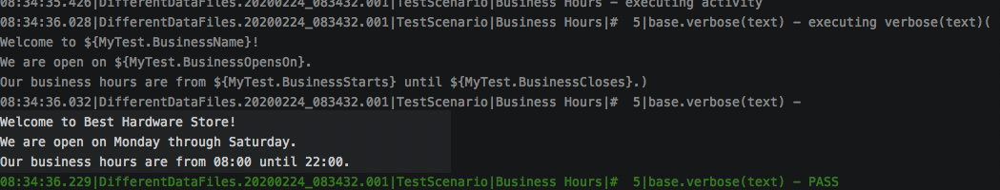

It is always prudent to design one's automation script to include all possible usage. When it comes to data variables, 
one should give careful consideration of their context and environment-specific values. However, at times the value
of a data variable might not be readily available at the time of design or automation script development. This is where
the command-line option comes to handy.

The idea with the command-line option is to provide a mechanism of either providing or overriding data variables at the 
time of execution. This means can use one set of data variable at the time of script development, but change them at the
time of execution **WITHOUT** modifying existing automation artifacts (scripts, data files, etc.). This also means that 
one can provide different values or different overrides per execution, making this feature particularly useful for 
one-off or just-in-time data changes. Furthermore, the command-line option is useful and easy for integrating with CI/CD
environments. 

Let's see this in action!


### Example
Here's a simple automation script (`artifact/script/DifferentDataFile.xlsx`):<br/>


Below is the matching data file, `artifact/data/DifferentDataFile.data.xlsx`, to this script:<br/>
 &nbsp; 

Instead of modifying the content of the data file, we can use the command-line option to accomplish the same (line 
wrap to improve readability):<br/>
```
./nexial.sh -script $PROJECT_HOME/artifact/script/DifferentDataFiles.xlsx
    -override MyTest.BusinessCloses=22:00
    -override MyTest.BusinessName="Best\ Hardware\ Store"
```

We can see the execution output showing the command-line overrides taking effect. Instead of printing out 
`Acme Hardware`, as defined in the data file, we see `Best Hardware Store` instead. Similarly for 
`${MyTest.BusinessCloses}` data variable (`22:00` instead of `21:00`):<br/>


Note the following:
1. There can be any number of command-line option `-override` to override any data variable or to create new data 
   variables
2. Data variables defined via command-line option override those defined in data files and `project.properties`
3. Additional care might be needed for data values that contain special characters. For example, 
   - spaces should be double-quoted and escaped with backslashes (as in `"data\ value\ with\ spaces"`) for 
     Mac/*NIX environment; 
   - pipe character (`|`) should be escaped with caret character (`^`) for Windows environment 
     (as in `value1^|value2^|value3`)


-----

### Conclusion
Using the command-line option, one can override data variables at the time of execution, making this option great for
just-in-time deviation as needed. It is suitable for CI/CD environment as well since almost all CI/CD toolset 
(such as Jenkins) have great support command-line options.