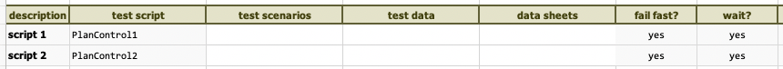
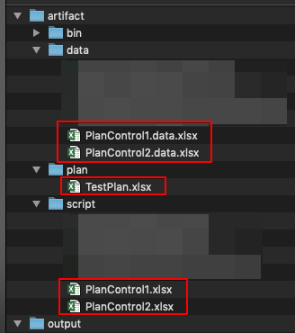
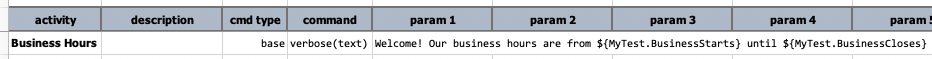

Nexial provides a mechanism to execute multiple scripts, either in succession or in sequence through the use of a
[test plan](../userguide/UnderstandingExcelTemplates#anatomy-of-a-nexial-test-plan). A test plan organizes the order 
of executions across multiple scripts, even those in different projects (i.e. different project directories). Also, one 
can associate different data files and datasheets per script execution, making the test plan a powerful tool to create 
intricate and dynamic automation. Let's see this in more detail.

### Primer on Test Plan
Suppose we have the following test plan (`arifact/plan/TestPlan.xlsx`): 
 

This test plan references 2 scripts: `PlanControl1` and `PlanControl2`. Consistent with Nexial's design and approach 
towards convention, the script location is automatically resolved based on the location of the test plan. Similarly, the 
data file is also resolved by the same convention, which is:

>  
> The test plan resides in `artifact/plan/` 
> The scripts reside in `artifact/script/` 
> The data files reside `artifact/data/[SCRIPT_NAME].data.xlsx`

Here's the corresponding project directory structure: 

Notice that:
- In the test plan, the scripts are referenced as `PlanControl1` and `PlanControl2`. Nexial will add the `.xlsx` 
  extension as needed.
- Since no datasheet is specified in the test plan, the convention, _once again_, dictates that the datasheet matching
  to the executing scenario and the fallback `#default` datasheet will be loaded during execution.

Here are the content of the referenced scripts and data files:

| artifact                                                       | content                           |
|----------------------------------------------------------------|-----------------------------------|
| `artifact/script/PlanControl1.xlsx` (scenario: `Scenario`) |  |
| `artifact/data/PlanControl1.data.xlsx` (only `#default`)   |  |
| `artifact/script/PlanControl2.xlsx` (scenario: `Scenario`) |  |
| `artifact/data/PlanControl2.data.xlsx` (only `#default`)   |  |

When this test plan is executed, Nexial will read its content and execute:
1. The scenario `Scenario` in `artifact/script/PlanControl.xlsx`, using the `#default` datasheet in 
   `artifact/data/PlanControl1.data.xlsx`
2. The scenario `Scenario` in `artifact/script/PlanContro2.xlsx`, using the `#default` datasheet in 
   `artifact/data/PlanControl2.data.xlsx`

The execution output looks like this: 
`./nexial.sh -plan $PROJECT/artifact/plan/TestPlan.xlsx` 

Observe that:
- the scripts are executed in sequence as specified in the test plan
- each script execution ends with a dedicated summary outlining the high-level execution outcome. There is also a 
  separate execution output (in Excel) per script

-----

### Dealing with Multiple Script and Data
The test plan gives us a singular view of the organization of our automation. We can specify the scripts to execute 
and the sequence of such execution. More importantly, we can also specify the data files and datasheets to use when 
executing each script (i.e. breaking convention). Below are some examples.

#### Case #1: Running the same execution with customized data files
Running the same execution but using `artifact/data/QA data.xlsx` as the data file for each script: 

##### Case #2: Running the same execution with customized data files (second variation)
Running the same execution, except that the second script will use `artifact/data/BigCompany-data.xlsx` instead of
the conventional `artifact/data/PlanControl2.data.xlsx` 

#### Case #3: Running the same execution with customized datasheets
- When executing `artifact/script/PlanControl1.xlsx` script, use `artifact/data/PlanControl1.data.xlsx` as data file 
  but load the `Base`, `QA1` and `#default` datasheets **REGARDLESS** of the test scenario to execute.
- When executing `artifact/script/PlanControl2.xlsx` script, use `artifact/data/PlanControl2.data.xlsx` as data file 
  but load the `Commons` and `#default` datasheets **REGARDLESS** of the test scenario to execute.

Note that:
- the `#default` datasheet is implicitly considered when loading any data file, but it will always act as the 
  "fallback" (least priority data definition).
- when datasheet(s) is/are specified in a test plan, the convention of "auto-matching" of test scenario against 
  datasheet will suspend. This means that the specified datasheet will be loaded for all the test scenarios of the 
  corresponding script.
- using this technique, one can think of a data overriding strategy where the data of a "higher" environment overrides
  those of the "lower" ones. For example, `#default,DEV,QA,UAT,PROD` - would mean the data in `PROD` overrides those in
  `UAT`, the data in `UAT` overrides those in `QA`, and so on.

#### Case #4: Running the same execution with customized data file location
Running the same execution, except that the second script will use `C:\CustomerA\data.xlsx` as the data file, which is
outside the given project directory structure.

This is not usually recommended since it would decrease the portability of the project. But it is at times necessary 
(and thus allowed in Nexial). Imagine that instead of `C:\CustomerA` as the data file location, we might have a mapped
network drive, like `X:\Customers\CustomerA`. As such, collaboration across different groups can be easily achieved to 
create a co-sharing data strategy.

-----

### Conclusion
Through the use of test plan, Nexial provides a mechanism to execute multiple scripts with the flexibility to match 
against different data files and datasheets. One can employ this feature to handle environment-specific data 
requirements. Environment-specific data and data variables can be managed independently and one data set can override 
another at the time of execution with ease - via the Nexial test plan.
