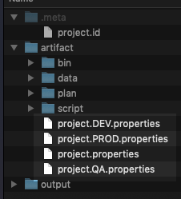
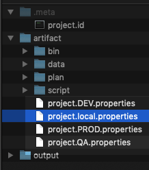

Nexial provides a mechanism to manage a set of project-level data variables - via `artifact/project.properties`. Using 
this file, one can define a set of data variables that can be used for all the artifacts in the same project structure. 
This feature helps to streamline data management and expedite script development. 


### Toggling Multiple `project.properties`
Suppose we manage environment-specific data variables in different `project.properties` files, like this:<br/>


Here are their respective content (shorten for brevity):<br/>
- `project.properties`
   ```
   ...
   # local environment
   MyTest.site.homepage=http://localhost:8080/home
   ```

- `project.DEV.properties`
   ```
   ...
   # DEV environment
   MyTest.site.homepage=http://sdcsdev01:8888/v2/home
   ```

- `project.QA.properties`
   ```
   ...
   # QA environment
   MyTest.site.homepage=http://sdcsqa02/v2/home
   ```

- `project.PROD.properties`
   ```
   ...
   # PROD environment
   MyTest.site.homepage=https://www.superduper123.com/home
   ```

As shown, each `project.properties` file contains its version of `MyTest.site.homepage`. The main idea here is to
ensure that along with the data definition in `project.properties`, the environment-specific one is loaded as well.
This means that when automating against the QA environment, we would load `project.properties` as well as 
`project.QA.properties`. Similarly, when we automate against the PROD environment, we would load `project.properties` as
well as `project.DEV.properties`, and so on.

It is paramount to note that the duplicate data variables in the same properties file mean that the last one would
supersede that those that precede. Hence we would want the environment-specific ones to be appended - as opposed to 
_prepended_ - to `project.properties`.

A simple approach would simply be appending the content of the environment-specific properties file to 
`project.properties` each time before execution. While this works, it is both tedious and error-prone. A better 
approach is to automate the merging of `project.properties` and the environment-specific one.

To accomplish this, we can use a simple batch script (or shell script) to automate the process of combining the right 
`project.properties` files together before running the Nexial automation thereafter. But before we proceed to create 
this script, there's one more thing we should do:

### **Rename `project.properties` to `project.local.properties`**<br/>


The expected `project.properties` file would be generated dynamically by our batch/shell script each time we run it:
1. Ensure proper command-line arguments are supplied
2. Backing up the existing `project.properties`, if any. This step is optional
3. Combine `project.local.properties` and an environment-specific properties file (e.g. `project.DEV.properties`) into
   `artifact/project.properties`
4. Run Nexial automation as normal

There are many ways to accomplish this. Below are 2 working examples for your consideration (Mac and Windows):

#### [`artifact/bin/my-nexial.sh`](https://github.com/nexiality/tutorials/blob/master/examples/data-management/artifact/bin/my-nexial.sh)
```batch
#!/usr/bin/env bash

# at least 3 arguments is expected
if [[ $# -lt 3 ]]; then
  echo
  echo "ERROR: No input found. Please run this script like this:"
  echo "$0 [local|DEV|QA|PROD] [-script|-plan] [location of target script or plan] ..."
  echo
  exit 243
fi

# find location of this script and this project
PROJECT_BIN_HOME=$(
  cd "$(dirname "$0")" || exit
  pwd -P
)
PROJECT_HOME=$(
  cd $PROJECT_BIN_HOME/../.. || exit
  pwd -P
)

PROJECT_PROP="$PROJECT_HOME/artifact/project.properties"
LOCAL_PROP=$PROJECT_HOME/artifact/project.local.properties
TARGET_PROP=$PROJECT_HOME/artifact/project.$1.properties

# check if requested project.properties exists
if [[ ! -f $TARGET_PROP ]]; then
  echo
  echo "ERROR: requested file $TARGET_PROP does not exists or is unreadable"
  echo
  exit 244
fi

# backup existing project.properties, if found
if [[ -f $PROJECT_PROP ]]; then
  echo "moving existing project.properties to project.properties.BAK"
  mv $PROJECT_PROP ${PROJECT_PROP}.BAK
fi

# combining local and requested project.properties
# save combined properties to project.properties file
if [[ "$LOCAL_PROP" == "$TARGET_PROP" ]]; then
  echo "copy $LOCAL_PROP to $PROJECT_PROP"
  cat "$TARGET_PROP" >"$PROJECT_PROP"
else
  echo "copy $LOCAL_PROP and $TARGET_PROP to $PROJECT_PROP"
  cat "$LOCAL_PROP" "$TARGET_PROP" >"$PROJECT_PROP"
fi

# run nexial
echo "running Nexial..."
if [[ "$NEXIAL_HOME" == "" ]]; then
  NEXIAL_HOME=~/projects/nexial-core
fi

shift 1
$NEXIAL_HOME/bin/nexial.sh $*

exit $_
```

#### [`artifact\bin\my-nexial.cmd`](https://github.com/nexiality/tutorials/blob/master/examples/data-management/artifact/bin/my-nexial.cmd)
```batch
@echo off
setlocal enableextensions

REM at least 3 arguments is expected
if "%3"=="" goto invalid_input

REM find location of this script and this project
SET PROJECT_BIN_HOME=%~dp0..
SET PROJECT_HOME="%PROJECT_BIN_HOME%/../.."
SET PROJECT_PROP="%PROJECT_HOME%/artifact/project.properties"
SET LOCAL_PROP="%PROJECT_HOME%/artifact/project.local.properties"
SET TARGET_PROP="%PROJECT_HOME%/artifact/project.%1.properties"

REM check if requested project.properties exists
if not exist %TARGET_PROP% (
  echo.
  echo ERROR: requested file %TARGET_PROP% does not exists or is unreadable
  echo.
  exit /B 244
)

REM backup existing project.properties, if found
if exist %PROJECT_PROP% (
  echo moving existing project.properties to project.properties.BAK
  move %PROJECT_PROP% %PROJECT_PROP%.BAK
)

REM combining local and requested project.properties
REM save combined properties to project.properties file
if %LOCAL_PROP%==%TARGET_PROP% (
  echo copy %LOCAL_PROP% to %PROJECT_PROP%
  cat "$TARGET_PROP" >"$PROJECT_PROP"
) else (
  echo copy %LOCAL_PROP% and %TARGET_PROP% to %PROJECT_PROP%
  cat "$LOCAL_PROP" "$TARGET_PROP" >"$PROJECT_PROP"
)

REM run nexial
echo "running Nexial..."
if "%NEXIAL_HOME%"=="" (
  set NEXIAL_HOME=C:\projects\nexial-core
)

shift 1
%NEXIAL_HOME%/bin/nexial.cmd $*

goto end


:invalid_input
    echo.
    echo ERROR: Invalid input. Please run this script like this:
    echo %0 [ local ^| DEV ^| QA ^| PROD ] [ -script ^| -plan ] [ target script or plan ] ...
    echo.
    exit /B 243

:end
    exit
```

Now, instead of running the `$NEXIAL_HOME/bin/nexial.sh` or `%NEXIAL_HOME%\bin\nexial.cmd` directory, one would run
one of the above scripts. And because it is a script, this can be used in any of the CI/CD environment (such as Jenkins)
as well! Below is a few examples on using this script:

Example 1: running `MyTestPlan1.xlsx` on `QA` (Windows)
```batch
cd %PROJECT_HOME%
cd artifact\bin
my-nexial.cmd QA -plan %PROJECT_HOME%\artifact\plan\MyTestPlan1.xlsx
```

Example 2: running `RegressionScript_152.xlsx` on DEV (*NIX)
```batch
cd $PROJECT_HOME
cd artifact/bin
./my-nexial.sh DEV -script $PROJECT_HOME/artifact/script/RegressionScript_152.xlsx
```

-----

### Conclusion
The `project.properties` concept is an effective way to manage project-wide data variables and their respective values.
These data variables can be expressed as plain data value, referenced data variables, [functions](../functions) or 
[expressions](../expressions). Using simple scripts we can further maintain environment-specific, project-wide data 
variables with ease!
