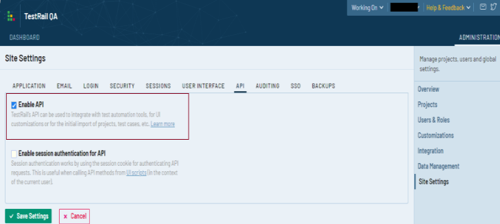

### Overview
TestRail is a test case and test management software tool that helps teams to manage and track their software testing
efforts. TestRail enables you to create, manage, and organize test cases and suites within an optimized user interface
and application structure. For more details, please walk through [TestRail Documentation](https://www.gurock.com/testrail/docs/user-guide/getting-started/walkthrough)

### HOW to import Testcases in TestRail
Importing testcases to TestRail includes following steps:-
1. Prerequisite configuration of TestRail account to access suites using its APIs.
2. Configure Nexial Data Variables to access TestRail through apis.
3. Configure project meta file to access required TestRail project.
4. Import testcases using Nexial batch file [nexial-tms-importer](./BatchFiles#nexial-tms-importer)

**Prerequisite Configuration of TestRail**:- 
User need to configure TestRail account to access it through APIs.
- Admin must enable API to allow access through APIs. To activate, go to `ADMINISTRATION => Site Settings => API`. 
  
- TestRail project in which test cases to be imported should use multiple suites to manage test cases. So while creating 
new project go to `ADMINISTRATION => Projects => Add Project` 
  

**Configure Using Data Variables**:- 
- [`nexial.tms.source`](../systemvars/index#nexial.tms.source): User should specify tms source tool to import testcases. In this case, it must be **testrail**.
- [`nexial.tms.url`](../systemvars/index#nexial.tms.url): URL which consists of organization name in it. e.g. `https://<organization>.testrail.io/`.
- [`nexial.tms.username`](../systemvars/index#nexial.tms.username): Username/Email Id used to log in to TestRail account.
- [`nexial.tms.password`](../systemvars/index#nexial.tms.password): Password used to log in to TestRail account.

~~~
# values are for testrail for reference except source name
nexial.tms.source=testrail
nexial.tms.url=https://TestRailOrganization.testrail.io/
nexial.tms.username=xyz@gmail.com
nexial.tms.password=testrailPassword
~~~

User needs to provide above configuration to access testrail through Nexial variables using one-time setup, you can provide 
TestRail integration configuration details once and build `setup.jar` using [`nexial-setup.cmd`](BatchFiles#nexial-setup) 
or [`nexial-setup.sh`](BatchFiles#nexial-setup).


**Note : `projectId` must be project id in the TestRail which can be seen in the URL once you open the TestRail project.**

### HOW to upload Execution Results
1. **(Mandatory)** Make sure testcases are already imported to Test Rail before uploading result as explained above.
2. Test result is uploaded as Test Runs with cumulative results for testcases from `execution-detail.json`
3. Upload results for imported test case using batch file [`nexial-tms-result-uploader.cmd|.sh`](BatchFiles#nexial-tms-result-uploader)

### See Also
- [Azure DevOps Setup](AzureDevOpsSetup)
- [Jira Setup](JiraSetup)
- [Tms Management](TmsManagement)
