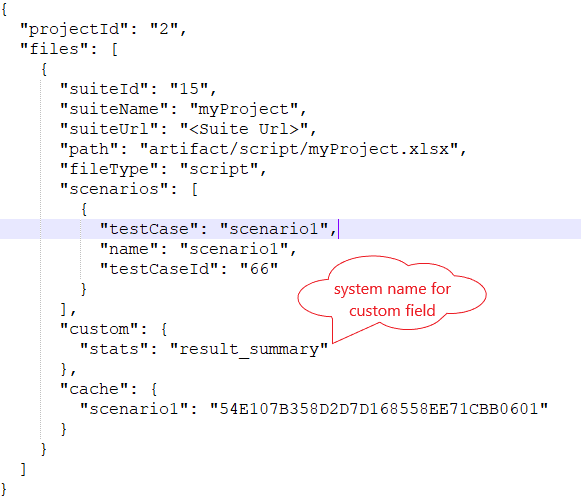

### Overview
TestRail is a test case and test management software tool that helps teams to manage and track their software testing
efforts. TestRail enables you to create, manage, and organize test cases and suites within an optimized user interface
and application structure. For more details, please walk through [TestRail Documentation.](https://www.gurock.com/testrail/docs/user-guide/getting-started/walkthrough)

### HOW to import Testcases in TestRail
Importing testcases to TestRail includes following steps:-
1. Prerequisite configuration of TestRail account to access suites using its APIs.
2. Configure Nexial Data Variables to access TestRail through apis.
3. Configure project meta file to access required TestRail project.
4. Import testcases using Nexial batch file [nexial-tms-importer.](BatchFiles#nexial-tms-importer)

**Prerequisite Configuration of TestRail**:- 
User need to configure TestRail account to access through APIs.
- Admin must enable API to allow access through APIs. To activate, go to `ADMINISTRATION => Site Settings => API`. 
  
- TestRail project in which test cases to be imported should use multiple suites to manage test cases. So while creating 
new project go to `ADMINISTRATION => Projects => Add Project` 
  

**Configure Using Data Variables**:- 
- [`nexial.tms.source`](../systemvars/index#nexial.tms.source): User should specify tms source tool to import testcases. In this case, it must be **testrail**.
- [`nexial.tms.url`](../systemvars/index#nexial.tms.url): URL which consists of organization name in it. e.g. `https://<organization>.testrail.io/`.
- [`nexial.tms.username`](../systemvars/index#nexial.tms.username): Username/Email Id used to log in to TestRail account.
- [`nexial.tms.password`](../systemvars/index#nexial.tms.password): Password used to log in to TestRail account.

~~~
# values are for testrail for reference except source name
nexial.tms.source=testrail
nexial.tms.url=https://TestRailOrganization.testrail.io/
nexial.tms.username=xyz@gmail.com
nexial.tms.password=testrailPassword
~~~

User needs to provide above configuration to access testrail through Nexial variables using one-time setup, you can provide 
TestRail integration configuration details once and build `setup.jar` using [`nexial-setup.cmd`](BatchFiles#nexial-setup) 
or [`nexial-setup.sh`](BatchFiles#nexial-setup).


**Note : `projectId` must be project id in the TestRail which can be seen in the URL once you open the TestRail project.**

**Import Test cases**:-
- User can import testcase using Nexial batch file [nexial-tms-importer.](BatchFiles#nexial-tms-importer)
- If there are any changes made to testcases for example adding new test case, deleted or updated,
user need to update testcases using the same batch file command [nexial-tms-importer.](BatchFiles#nexial-tms-importer)

Sample screenshots after importing test result: 
- Test Suite screenshot 

- Individual Test Case screenshot

### HOW to upload Execution Results
1. **(Mandatory)** Make sure testcases are already imported to Test Rail before uploading result as explained above.
2. Test result is uploaded as Test Runs with cumulative results for testcases from `execution-detail.json`. Make sure 
during script execution in Nexial, [`nexial.generateReport`](../systemvars/index#nexial.generateReport) must be set to `true`.
3. Upload results for imported test case using batch file [`nexial-tms-result-uploader.cmd|.sh`](BatchFiles#nexial-tms-result-uploader).

**Steps while uploading Execution Result(FYI):-**
1. Nexial will create new Test Run for first execution for Test Suite. 
2. User will get option to close test run or not at the end after uploading the result.
3. If Test Run for imported Test Suite is active(not closed), then next time execution test result will be uploaded to
the same test run.
4. If Test Run is not active(Closed), new test run will be created.

Sample screenshots after uploading test result: 
- Test Run created for sample execution with attachment output excel and html report 

- Multiple test result uploaded without closing test run 

#### Create custom fields
For TestRail, if user wants to add execution results for imported test cases, user needs to create custom field for 
execution stats like pass count, fail count and skip count. Please follow the steps to add custom fields:
1. Create customized result field in the TestRail. Go to `ADMINISTRATION => Customizations => Result Fields`. 
 
2. Provide label(shown on testrail) and system name(**reference in the project.meta.json**) for the field.

3. Specify custom result field in the `project.meta.json` for the reference to add execution result.

### See Also
- [Azure DevOps](AzureDevOpsSetup)
- [Jira](JiraSetup)
- [Tms Management](TmsManagement)
