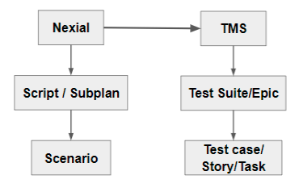
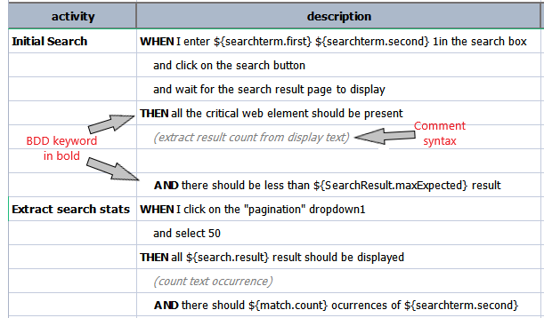

> Nexial supports TMS(Test Management Service) Integration through the use of System Variables. By default, importing
> test cases to particular TMS tools is not enabled.

### TMS Integration
Test Management Service is managing test process in more efficient way and improving productivity through
managing and tracking bugs, collaborating test cases with team and automated build and deployment of code. Test
Management tool is software used to manage test cases. Nexial supports few of such widely known tools for
Test Management. For example `Azure DevOps`, `TestRail`, `JIRA` etc. In the future, Nexial might support other well
known tools depending on requirement.

The TMS integration allows Nexial to import test cases to supported TMS tools. This means Nexial scripts and subplan
can be imported as a test suite in tms.

**Note**:- 
Even though mapping depends on each individual tool, Nexial Test artifact mapped to TMS tool mainly like below,

As of now, TMS tools supported by Nexial are:
- [Azure DevOps](https://azure.microsoft.com/en-in/services/devops/)
- [TestRail](https://www.gurock.com/testrail/)
- [JIRA](https://www.atlassian.com/software/jira)

Additionally, Nexial also provides features like,
- Publishing execution results to TMS using [nexial-tms-result-uploader](BatchFiles#nexial-tms-result-uploader)
- Close previous test runs using [nexial-tms-closeRun](BatchFiles#nexial-tms-closeRun)

### Configuring Data Variables
1. [`nexial.tms.source`](../systemvars/index#nexial.tms.source) - the source name of tms tool used. For example, `azure`, `testrail` etc.
2. [`nexial.tms.url`](../systemvars/index#nexial.tms.url) - url of the TMS tool.
3. [`nexial.tms.username`](../systemvars/index#nexial.tms.username) - username only if it is needed to access TMS tool.
4. [`nexial.tms.accessToken`](../systemvars/index#nexial.tms.accessToken) - access token or api token if it's used to access TMS tool instead of password
5. [`nexial.tms.password`](../systemvars/index#nexial.tms.password) - password only if it is needed to access TMS tool apis.

**Note**:- [`nexial.tms.accessToken`](../systemvars/index#nexial.tms.accessToken) will be given precedence over 
[`nexial.tms.password`](../systemvars/index#nexial.tms.password)

Configure TMS tools using above data variables using [TMS setup](../userguide/ServiceIntegration#tms-integration-setup)
onetime setup for TMS integration using `nexial-setup`. 
To learn more in detail, please go through individual tool setup documentation provided [TMS Tool Setup](#tms-tool-setup)

### BDD Keywords support
Behavior-driven development (BDD) and keywords are both widely used techniques to facilitate automated testing. It is 
used to write test case in domain specific and business readable language. So Nexial supports set of BDD keywords to 
write readable and beautified test cases which will be used to format and beautify description of test cases 
imported. The main reason to support BDD Keyword is to provide formatting and encourage automation tester to write good
quality test cases.  

To format test cases written in BDD format, user can import test case using [nexial-tms-importer](BatchFiles#nexial-tms-importer)
and by providing option `-b`. 
**Note**: Nexial script teststep description should start with one of the above keywords to have formatting on TMS.

Supported BDD keywords are:- 
**FEATURE, RULE, GIVEN, SCENARIO, EXAMPLE, WHEN, THEN, AND, BUT, BACKGROUND, SCENARIO_OUTLINE** 

Sample test case written in BDD format- 

### TMS Tool Setup
Following TMS tools are supported by Nexial as of now. Please walk through each TMS tool setup in details.
- [Azure DevOps](AzureDevOpsSetup)
- [TestRail Setup](TestRailSetup)
- [Jira Setup](JiraSetup)
