Here is the hierarchy of automation, in Nexial-speak:

```text
Test Plan                                  (commonly found in {PROJECT}/artifact/plan)
+-- (1 or more) Test Script                (commonly found in {PROJECT}/artifact/script)
    +-- (1 or more) Iteration              (defined via nexial.scope.iteration System Variable)
        +-- (1 or more) Scenario           (synonymous to worksheet in test script file)
            +-- (1 or more) Activity       (a sequence of related test step)
                +-- (1 or more) Test Step  (synonymous to command, which is either an action or validation)
```

As shown above, an "Activity" is a sequence of test steps, a "Scenario" is a series of "Activity", an Iteration is a
group of "Scenarios", and so forth.  From script development perspective, one can organize at different level of
abstraction to improve readability and reusability.


### Anatomy of a Nexial Script
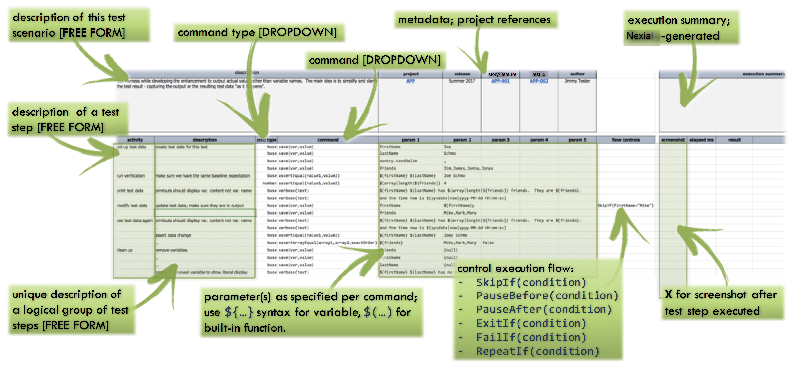

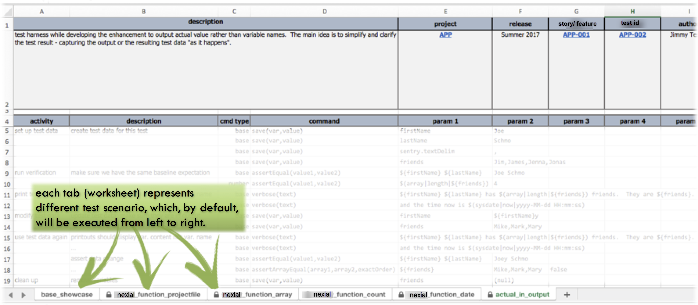

---------------------------------------------

### Anatomy of a Nexial Data File
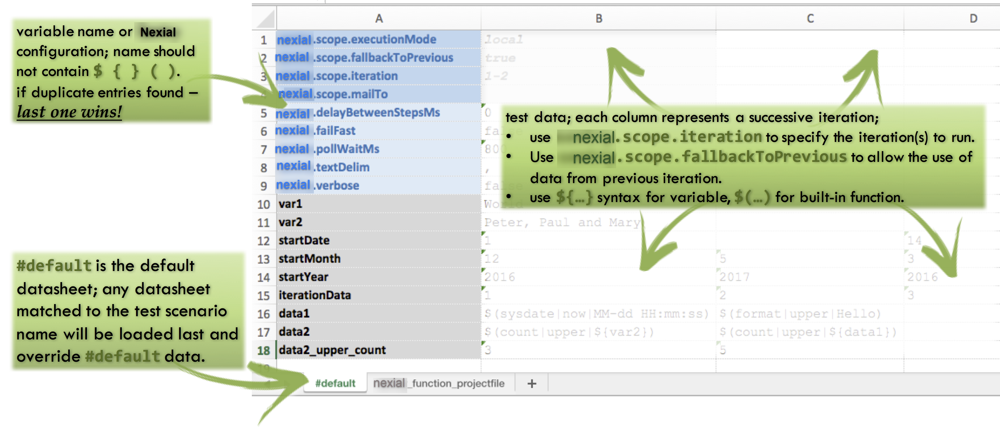

---------------------------------------------

### Anatomy of a Nexial Test Plan
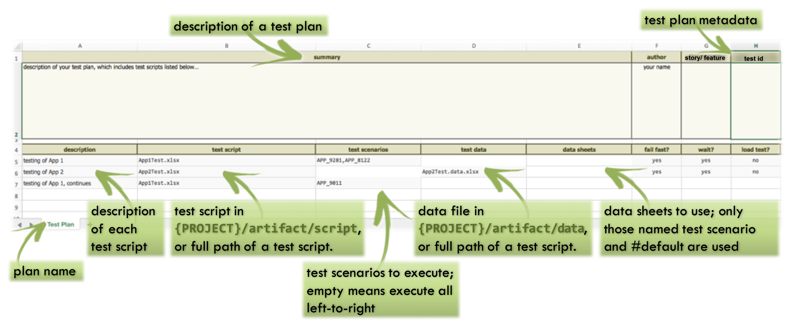

---------------------------------------------

### Anatomy of Nexial Output Files

#### Case Study 1: Single-Scenario Execution 
**During script design & development**:<br/>
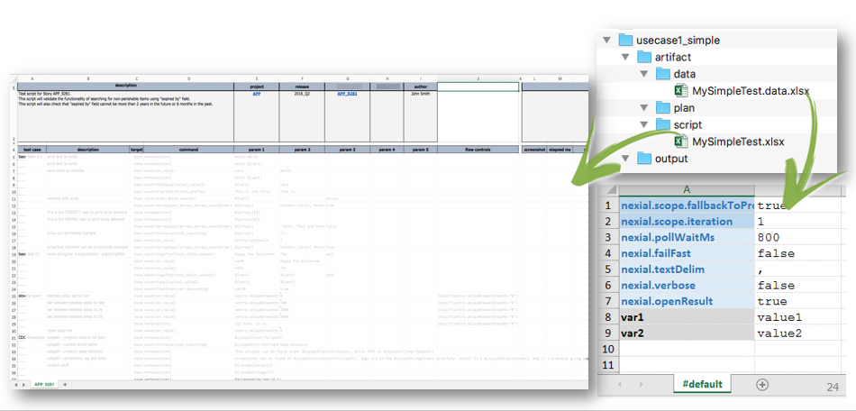

**After execution**:<br/>
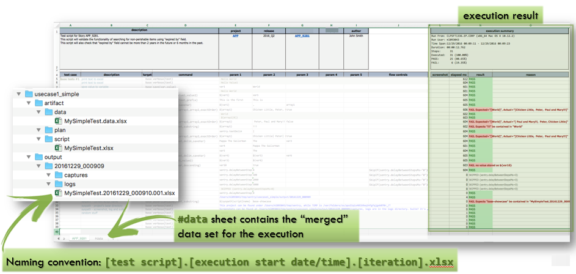

#### Case Study 2: Multi-Scenario Execution 
**During script design/ development**:<br/>
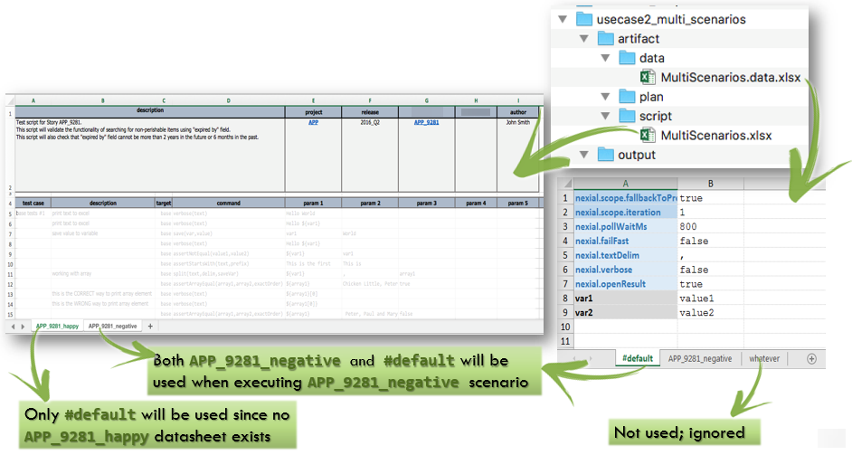

**After script execution**:<br/>
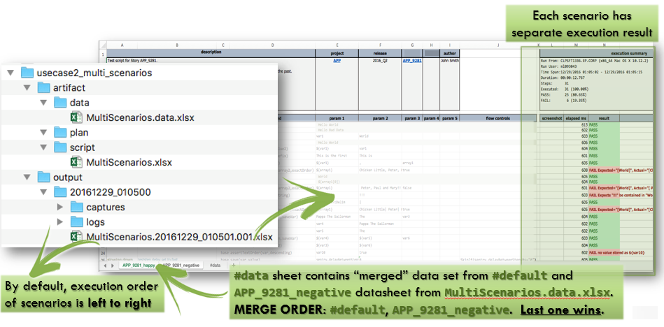

#### Case Study 3: Iteration
**During script design/ development**:<br/>
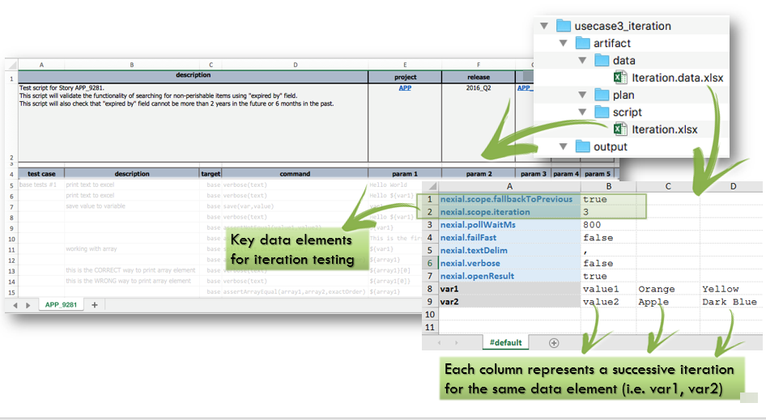

**After script execution**:<br/>
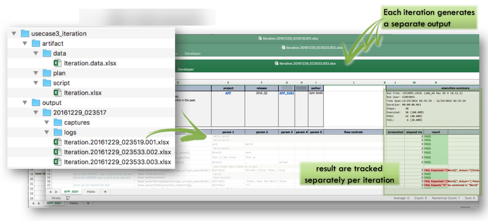

#### Use Case 4: Test Plan
**During script design/ development**:<br/>
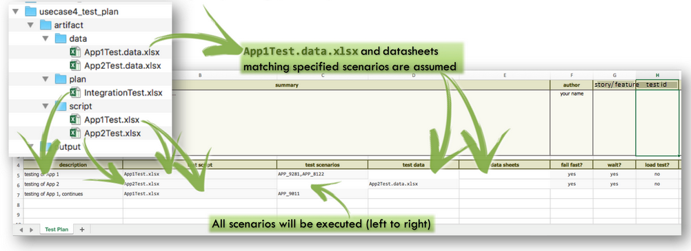

**After script execution**:<br/>
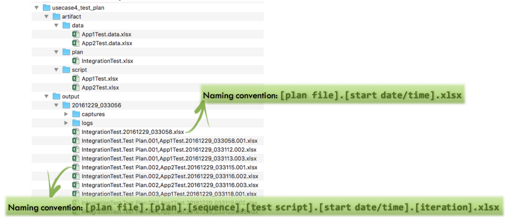


---------------------------------------------


