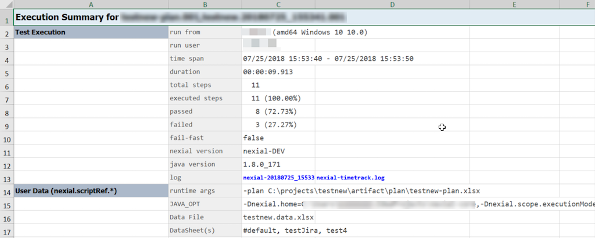
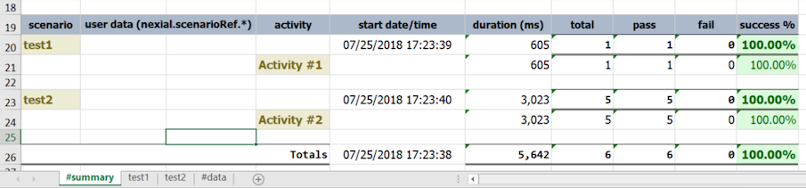
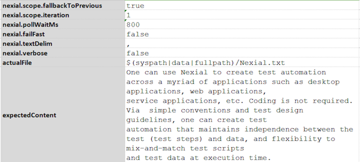

Nexial is designed to work with a variety of directory/file structures. One can specify target script or data file 
locations when running [`nexial.[cmd|sh]`](BatchFiles#nexialcmd--nexialsh). However it is recommended to follow 
the standard Nexial automation project structure so that:
1. Test artifacts are well-organized to reduce conflicts and to improve artifact management,
2. Your project can integrate more easily with other project(s) (think Integration Testing) that follow the same 
   structure,
3. Automation is simplified since Nexial would derive most of the path-related work for you via the same common 
   convention.


### Nexial Project Structure
Below is the general directory/file structure of a standard Nexial automation project:<br/>


1. `.meta/project.id`:<br/>
   <a name="project.id"></a>
   Technically, this is not a required file. It helps to keep all instances of the same project on
   using the same name, and thus easier to manage across people and teams. Let's further understand the underlying 
   problem via an example. Suppose John checks out `ProjectA` from the source code repository (say, GIT) to a local 
   directory, `C:\projects\ProjectA` but Sam checks out the same project to a local directory `C:\projects\MyProject`. 
   In addition, Amy checks out a _different_ project locally, also as `C:\projects\MyProject`.<br/> 
   <br/>
   By default Nexial derives the project ID based on the directory name. So as shown above, in John's case, the project 
   name would be `ProjectA` while both Sam's and Amy's would be `MyProject`. Whilst John and Sam are working on the 
   same project and Amy on a different one, it would appear as if Sam and Amy are on the same project and John on 
   another one. Such inconsistency can be further exasperated when one attempts to integrate these projects into a
   large test.
   
   To eliminate such issue, Nexial employs the concept of "metadata" so that all instances of the same project will be
   regarded as the same in terms of project identification. Contained in this `.meta/project.id` is such project 
   identification. Instead of deriving project ID based on the corresponding directory name, Nexial can identify the 
   same via the `.meta/project.id` file - which is committed to the corresponding source code repository and 
   subsequently checked out by project participants.<br/>
   
   
   To generate such file, one can create it manually, or use 
   [`bin/nexial-project.sh` or `bin/nexial-project.cmd`](BatchFiles#nexial-projectcmd--nexial-projectsh) batch file.

   Future effort of Nexial will use the same "metadata" concept for further enhancements such as execution output
   analysis.
   
2. The `artifact` directory contains 3 sub-directories: `data`, `plan`, `script`. These are the directories are used 
   to store test data, test plan and test scripts respectively.

   1. `artifact/script` - this directory will store your test scripts.  The script files may be named to your 
   likings.  Generally the file name would reflect the overall functionality targeted for automation. Note that this is
   different than the naming recommendation for the worksheets within each test script. Each worksheet should reflect
   a test scenario, such as "User Login", "Search for Best Deal", "Import Client Data" and "Complete Order". The 
   test script would a collection of related scenarios and thus be named like "Guest Access to AppX", "User 
   Registration", and "Monthly Client Data Import".<br/><br/>
   Each sheet (test scenario) two sections: header (description of a test scenario) and body (test steps to automate).
   For better understanding about scenario and test steps of test scripts, script developer can provide information in 
   `description` section of respective sections, as such test object and user acceptance criteria.<br/><br/> 
   The [macro library files](../commands/base/macro(file,sheet,name)) are stored in this location as well.

   2. `artifact/data` - this directory will store your test data.  By default the data file is expected to be named in
   correspondent to the test script: `<TEST SCRIPT NAME>.data.xlsx`.  But this convention can be overridden during
   execution via the `-data` flag to [`nexial.[cmd|sh]` script](BatchFiles#nexialcmd--nexialsh). Similar to test 
   scripts, each data file would contain one or many data sheets (worksheets) that correspond to the test scenarios. 
   Again, this is the convention. Deviating from this convention can be attained via the `-datasheet` flag to 
   [`nexial.[cmd|sh]` script](BatchFiles#nexialcmd--nexialsh).
   In general, other data files such as SQL, JSON, test data files (text) are stored in this location as well.

   3. `artifact/plan` - this directory will store all the test plan.  Each test plan may contain one or more test 
   scripts and data files.  It may contain test scripts and data files from a different project as well. For test 
   artifacts of the same project, and the standard convention is followed, they can be referenced simply by the file
   name. In other words, test scripts are assumed to be found in `artifact/script` directory and data files are
   assumed to be found in `artifact/data` directory. One may use relative path, such as 
   `../../AnotherProject/artifact/script/AnotherScript.xlsx`, to reference test artifacts of another project. 
   
   4. `artifact/project.properties` (not shown above) - this is a "reserved" file designated to maintain project-wide 
   data and configuration. With any automation project, there are various "scopes" of data. Some data is meant for a 
   specific scenario - such should be stored within the datasheet (worksheet in data file) named after that scenario. 
   Some data is meant to be used through an entire test script - such should be stored in the `#default` datasheet of 
   the corresponding data file. Some data, however, is reusable across the entire project. This is the purpose of 
   `artifact/project.properties`.
      ##### `project.properties`
      The main purpose of `artifact/project.properties` is to manage data that is common across the entire project 
      (i.e. the same project directory). Information such as database connectivity, application URL, commonly used 
      locators, etc. can be stored in one place. This improves reuse and maintainability. Here are the rules about 
      `project.properties`:
       1. It must be found under the project directory as `artifact/project.properties`. 
       2. It is expected to be a file that contains the standard name-value pairs, as in `name1=value1`. Each pair is 
          separated by newline. 
       3. It may contain custom data variables as well as Nexial system variables. 
       4. Data variables defined in `project.properties` will override the same defined in a data file.

       Let's have a look at project.properties file:<br/>
       
       ```properties
       # You are reading the ".properties" entry.
       ! The exclamation mark can also mark text as comments.

       # The key characters =, and : should be written with a preceding backslash to ensure that 
       # they are properly loaded.
       # However, there is no need to precede the value characters =, and : by a backslash.
       key1 = value1
       key2=Value2

       # Backslash below tells the application to continue reading the value from the next line.
       message = Welcome to \
                 Nexial!

       # Add spaces to the key
       key with spaces = This is the value that could be looked up with the key "key with spaces".

       # If you want your property to include a backslash, escaped it by another backslash
       path=c:\\wiki\\templates
       ```
       For more information on properties file, refer to 
       <a href="https://docs.oracle.com/cd/E26180_01/Platform.94/ATGProgGuide/html/s0204propertiesfileformat01.html" 
       class="external-link" target="_nexial_link">Properties file format</a>. 

3. <a name="output"></a>The `output` directory contains the output of each test execution named as a `run id`, which is 
   simply the timestamp of the start of an execution.  The `captures` directory stores all the screenshots and capture 
   videos (if any). The `logs` directory stores all the log files, with the main log file named as 
   `nexial-[START DATE/TIME].log`. The execution output file is named similarly to the corresponding test script:
   `[TEST SCRIPT NAME].[START DATE/TIME].[ITERATION].xlsx`. It is generally a good idea to keep output separated by 
   its execution. Hence the timestamp-based approach allows each execution its dedicated output directory. One can 
   consider using the same output location to store any output files generated as part of the execution. See 
   [`$(syspath|out|...)`](../functions/$(syspath)#available-functions) for more details.
   When [`nexial.outputToCloud`](../systemvars/#nexial.outputToCloud) to set to `true`, the generated output will be
   uploaded to designated cloud location and removed from local output directory.

   1. The generated output file comes with a `#summary` sheet, wherein the execution summary for that iteration is 
      shown. Along with summary information, additional execution details are also available:
      1. `run from`: the host from which this execution was conducted.
      2. `run user`: the user of the operating system that performed the execution.
      3. `java version`: the version of Java (JRE or JDK) used for this execution.
      4. `nexial version`: the version of Nexial used for this execution.
      5. `Data File`: the data file (file name only) used for this execution.
      6. `DataSheet(s)`: the data sheets from which test data was retrieved during execution.
      7. `runtime args`: the command line argument used in this execution. Typically this describes the information 
          entered after `nexial.cmd` or `nexial.sh`.
      8. `JAVA_OPT`: additional runtime System properties (i.e. `-D...`) configured for this execution.
      Here's a sample output file to illustrate the same:<br/>
      

      Additional entries, such as AUT version, test cycle, can be added here via the 
      [`nexial.scriptRef.*`](../systemvars/index.html#nexial.scriptRef) data variables.

   2. The `#summary` sheet also includes with consolidated test summary, such as duration per activity and total steps
      passed and failed.<br/>
      

   3. Nexial supports data variable substitution in the description section of each test scenario to contextualize 
      information particular to the execution conducted. This will help its readers to differentiate the different 
      output for the same script. For example, suppose we have the following data file and test script:
   
      Data File:<br/>
      

      Test Script/Scenario:<br/>
      
   
      Output File:<br/>
      

   4. <a name="summary"></a>Nexial also produces another output at the end of execution, one which provides a higher 
      level of execution output and extrapolation across test plans, test scripts, iterations, scenarios, and 
      activities:<br/>
      

      This file is always generated in the output directory as `execution-output.html`. It provides summary data points
      at multiple levels and links to the execution output file. Some amount of interactivity is available where
      one can toggle the visibility of script, iteration, scenarios and activities data.

   5. <a name="junit"></a>Along with the above-stated output, Nexial also produces a JUNIT compatible xml file. This
      XML file is always generated in the output directory as `junit.xml`. This file is useful when integrating with
      JUNIT-compatible tools and plugins such as:<br/>
      <br/>
      <br/>
      <br/>


### Additional Notes
For convenience, use the `bin/nexial-project.cmd` or `bin/nexial-project.sh` to generate the project structure for 
you. See [`nexial-project.[cmd|sh]`](BatchFiles#nexial-projectcmd--nexial-projectsh) for more details.

As a convention, it is recommended to use `C:\projects` or `/Users/<username/projects` (MacOSX/Linux) as the top-level 
directory for all your Nexial projects.

For more information, check out [Understanding Nexial Test Artifact](UnderstandingExcelTemplates).

### Adding new test artifact
Nexial is distributed with a set of empty, ready-to-use templates for your automation. Navigate to 
`${NEXIAL_HOME}/template` directory and you should see the available templates:<br/>


This template directory contains a few files – templates to get you starting a new test automation effort.  Let's have 
a closer look:

The `template` directory contains 4 files:
- **nexial-data.xlsx**: contains formatting rules to help differentiate between Nexial-specific data element and 
  application-specific / custom data element.  Technically one wouldn't need this template per se.  But it is 
  recommended to use this template for your new data file for consistency sake.
- **nexial-macro.xlsx**: contains the basic template of a Nexial macro script (reusable steps).  See 
  [base &raquo; `macro(file,sheet,name)`](../commands/base/macro(file,sheet,name)) for more details about macros.
- **nexial-script.xlsx**: the basic template of a test script.
- **nexial-testplan.xlsx**: the basic template of a test plan.

Once you copy one of these template to your project directory, remember to (1) place it in the designated location 
(`script/` for scripts, `data/` for data, etc.), and (2) rename according to [convention](#nexial-project-structure).

Lastly, the templates are shipped with each build.  They already contain the latest set of commands available for
each build.
