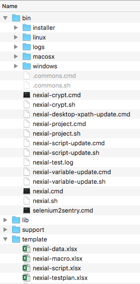

### Download Nexial
Nexial development team will continue to update the Nexial code base so that enhancements and fixes 
can be timely provided. If you haven't installed Nexial yet, be sure to follow the instructions 
here to [get Nexial set up in your local environment](InstallingNexial).

If you have already installed Nexial, here are the steps to updating Nexial on your local 
environment.

1.  Open your browser to <a href="https://github.com/nexiality/nexial-core/releases" class="external-link" target="_nexial_link">Nexial Release</a>
1.  Find the appropriate build or release to download. Nexial users are encouraged to use the 
				latest version when possible.
1.  Stop Nexial, if it's still running. Also ensure no webdriver or winium driver instance 
				are running.
1.  Override your current Nexial installation (should be under `C:\projects\nexial-core\`) with 
				the newly downloaded ZIP file. Be sure to check that the following directories are directly 
				under `C:\projects\nexial-core\` (a.k.a. `NEXIAL_HOME`):  
    
1.  Done! Now you have the latest version of Nexial.

### Update Command Listing
Before you can start using the latest version of Nexial, it is important to ensure that your 
scripts have the latest commands as well. Failure to follow the steps below would very likely 
hinder the new commands to be shown in your script files.

1.  Open console and point to `bin` directory under the Nexial installation directory.  
2.  run the script updater batch file, `nexial-script-update.cmd` with your project directory 
				as the parameter. For example:  
    **`nexial-script-update.cmd -v -t C:\projects\MyProject`**
3.  This batch file will scan through the specified project directory and update all appropriate 
				Excel files with the latest command.
4.  Now you are ready to use the latest version of Nexial.

### Stay in the Know
Want to stay in the know of the latest updates to Nexial? Sign up to the Slack channel dedicated 
for Nexial users!

Here's how:

1.  Open your browser to <a href="https://nexiality.slack.com/" class="external-link" target="_nexial_link">https://nexiality.slack.com</a>
2.  If you already have an account, proceed to sign in. Otherwise click on 
				<a href="https://nexiality.slack.com//signup/" class="external-link" target="_nexial_link">create an account</a> to create a free account.
3.  Once you've logged in, click on the "CHANNELS" link on the top-left corner of the Slack page.
4.  Search for `nexial-support` to find the channel dedicated for Nexial users.
5.  Click on the channel to join.

Alternatively (and encouraged), you can download 
<a href="https://slack.com/downloads" class="external-link" target="_nexial_link">the desktop or mobile version of Slack</a>. The native 
clients provide better OS integration. You can also invite others to a channel by clicking on the channel name and 
select "Invite team members to join...": 

**Any Nexial related questions, comments, suggestions, criticism, discussions, etc. are 
welcome in the <a href="https://nexiality.slack.com/messages/C9QH23P0U" class="external-link" target="_nexial_link">#nexial-support channel</a> All good 
common sense and <a href="http://www.dictionary.com/browse/netiquette" class="external-link" target="_nexial_link">netiquettes</a> enforced.**
